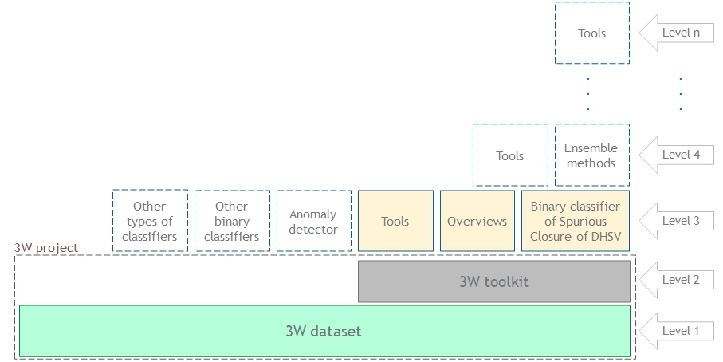

[![Apache 2.0][apache-shield]][apache] 
[![CC BY 4.0][cc-by-shield]][cc-by]
[![Code style][black-shield]][black]
[![Versioning][semver-shield]][semver]

[apache]: https://opensource.org/licenses/Apache-2.0
[apache-shield]: https://img.shields.io/badge/License-Apache_2.0-blue.svg
[cc-by]: http://creativecommons.org/licenses/by/4.0/
[cc-by-shield]: https://img.shields.io/badge/License-CC%20BY%204.0-lightgrey.svg
[black]: https://github.com/psf/black
[black-shield]: https://img.shields.io/badge/code%20style-black-000000.svg
[semver]: https://semver.org
[semver-shield]: https://img.shields.io/badge/semver-2.0.0-blue

# Welcome to the 3W Project contributing guide

:+1::tada::sparkles: Thank you for investing your time in contributing to the 3W Project! :sparkles::tada::+1:

We expect to receive various types of contributions from individuals, research institutions, startups, companies and partner oil operators. 

In this guide we present how you can propose each type of contributions that we expect.

# Table of Content

* [Getting started](#getting-started)
* [Making questions](#making-questions)
* [Before contributing](#before-contributing)
    * [Levels for contributions](#levels-for-contributions)
    * [3W Dataset's structure](#3w-datasets-structure)
    * [3W Toolkit's structure](#3w-toolkits-structure)
    * [Executing examples](#executing-examples)
* [Proposing contributions](#proposing-contributions)
    * [Citation](#citation)
    * [Bugs](#bugs)
    * [Documentation improvements](#documentation-improvements)
    * [Cosmetic improvements](#cosmetic-improvements)
    * [Other improvements](#other-improvements)
    * [New 3W Dataset's overviews](#new-3w-datasets-overviews)
    * [New approaches and algorithms](#new-approaches-and-algorithms)
    * [Additional requirements](#additional-requirements)
* [Backlog](#backlog)

# Getting started

The recommended first step is to read this [README](README.md) for an overview of the 3W Project.

# Making questions

Please do not open an issue to ask questions. Click on the Discussions link that appears in the top menu. If you don't get clarification, please open discussions to ask your questions so we can answer them.

# Before contributing

Before you can contribute to this project, you need to read and agree to the following documents:

* [CODE OF CONDUCT](CODE_OF_CONDUCT.md);
* [CONTRIBUTOR LICENSE AGREEMENT](CONTRIBUTOR_LICENSE_AGREEMENT.md);
* This contributing guide.

It is also very important to know, participate and follow the discussions. Click on the Discussions link that appears in the top menu.

## Levels for contributions

We expect to receive contributions at different levels, as shown in the figure below. Objects with background in yellow indicate types of contributions enabled by the 3W Project current version. The other objects above the 3W Project indicate types of contributions that will be enabled in the next versions. Some examples of contributions at each level are:

* Level 1: 
    * You can identify and report issues with data or annotations;
    * You can propose adding real, simulated or hand-drawn instances.
* Level 2:
    * You can identify, report and fix bugs;
    * You can propose documentation improvements;
    * You can recommend new specific problems.
* Level 3:
    * You can develop and propose approaches and algorithms for already incorporated problems;
    * You can elaborate and send us new overvies;
    * You can idealize, develop and propose new useful tools.
* Level 4:
    * You can develop and submit us ensemble methods;
    * You can generate and propose more complex and complete tools.
* Level n:
    * We see no limit to the levels for contributions.

## 3W Dataset's structure

At level 1, the 3W Dataset consists of multiple Parquet files saved in subdirectories of the [dataset](dataset) directory and structured as detailed [here](3W_DATASET_STRUCTURE.md). 

## 3W Toolkit's structure

At level 2, the 3W Toolkit is implemented in sub-modules as discribed [here](3W_TOOLKIT_STRUCTURE.md).

## Executing examples

To execute examples of how to use the 3W Toolkit available in this repository, see the instructions related to [reproducibility](README.md#reproducibility).
 
# Proposing contributions

We seek to adopt trunk-based development. [This article](https://www.atlassian.com/continuous-delivery/continuous-integration/trunk-based-development) explains some of the justifications and benefits of this practice.

For each type of expected contribution, there is a subsection below with specific instructions. The last subsection specifies additional requirements for contributions to be incorporated into this project.

## Citation

As far as we know, the 3W Dataset was useful and cited by the works listed [here](LISTS_OF_CITATIONS.md). If you know any other paper, master's degree dissertation or doctoral thesis that cites the 3W Dataset, we will be grateful if you let us know by commenting [this](https://github.com/Petrobras/3W/discussions/3) **discussion**. If you use any resource published in this repository, we ask that it be properly cited in your work. Click on the ***Cite this repository*** link on this repository landing page to access different citation formats supported by the GitHub citation feature.

## Bugs

Please open an **issue** to report any bug. If you've implemented a fix, please create a **pull request** on a branch called `bugs`.

## Documentation improvements

We believe that any part of the documentation for this project can be improved, including this guide. You can work on that and then create a **pull requests** on a branch called `documentation_improvements` directly.

It is important to keep in mind that this toolkit's documentation is generated in english and in Google format with [autoDocstring - Python Docstring Generator](https://github.com/NilsJPWerner/autoDocstring), which follows [PEP 257](https://peps.python.org/pep-0257/), and [pdoc3](https://pdoc3.github.io/pdoc/).

## Cosmetic improvements

Changes that are cosmetic in nature and do not add anything substantial to the stability, functionality, or testability of the 3W Project are also welcome. In this case, please create a **pull requests** on a branch called `cosmetic_improvements` directly.

## Other improvements

If you intend to work and propose a more significant improvement, please consult our [backlog](BACKLOG.md) first. If you have any questions about the most aligned strategy for the 3W Project, please consult or create **discussions**. When your improvement is ready, please create a **pull request** on a branch called `other_improvements`.

It is important to keep in mind that all source code is implemented according to the style guide established by [PEP 8](https://peps.python.org/pep-0008/). This is guaranteed with the use of the [Black formatter](https://github.com/psf/black) with default options. Therefore, while codes have lines up to 88 characters (Black formatter's default option), each line with docstring or comment must be up to 72 characters long as established in PEP 8.

## New 3W Dataset's overviews

Visualization is one of the most important steps in this type of project. Therefore, you can propose [Jupyter Notebooks](https://jupyter.org/) with different views. For this, submit a **pull request** on a branch called `new_3w_datasets_overviews` with a file named `overviews\[your_name_here]\main.ipynb` that you've developed. If we like your overview, your file could be listed in this repository as a 3W Toolkit's example of use.

## New approaches and algorithms

Would you like to share in this repository as 3W Toolkit's examples of use approaches and algorithms for already incorporated problems? The procedure for this is to submit a **pull request** on a branch called `new_approaches_and_algorithms` with [Jupyter Notebooks](https://jupyter.org/) that you've developed in the directory corresponding to the chosen problem. 

Specific problems will be incorporated into this project gradually. At this point, we can work on:

* [Binary classifier of Spurious Closure of DHSV](problems/01_binary_classifier_of_spurious_closure_of_dhsv/README.md).

## Additional requirements

Here are additional requirements for contributions to be incorporated into this project:

* As the forking workflow is used, every PR needs to be generated in a fork. A tutorial about different Git Workflows is available [here](https://www.atlassian.com/git/tutorials/comparing-workflows#centralized-workflow); 
* PRs will only be accepted if they pass the check automatically performed by the GitHub Action specified in [action-black.yml](.github/workflows/action-black.yml). If this check fails, check the generated log, use the latest version of [Black formatter](https://github.com/psf/black) to locally format the files as needed, then generate another PR.

# Backlog

The list of priority improvements for the 3W Project that we intend to develop collaboratively with the community is detailed in the file [BACKLOG.md](BACKLOG.md).