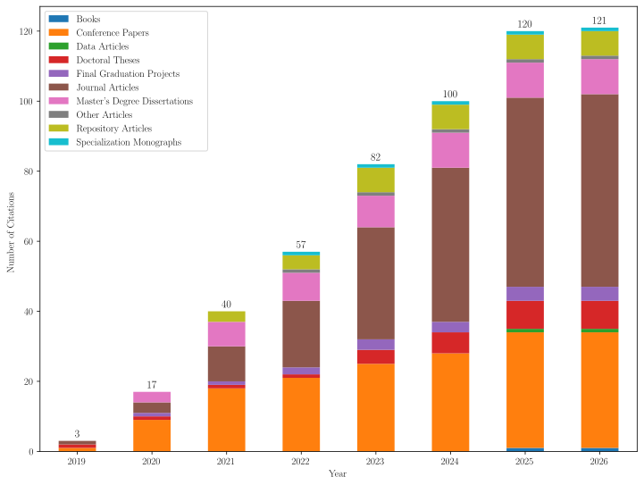
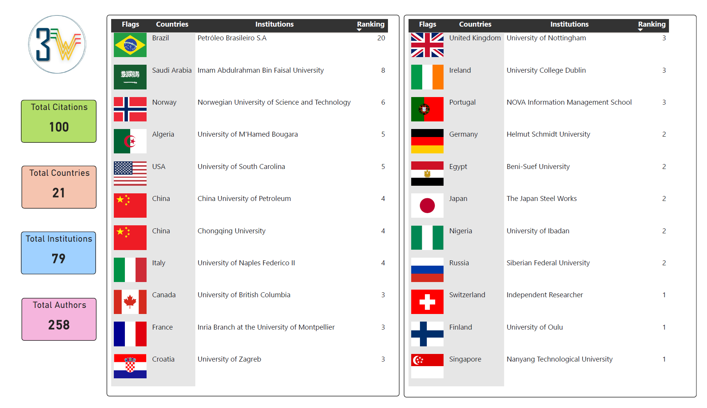
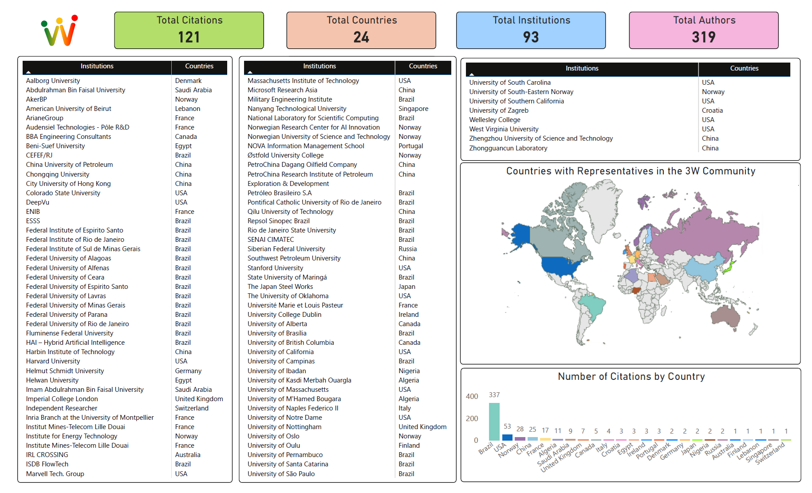
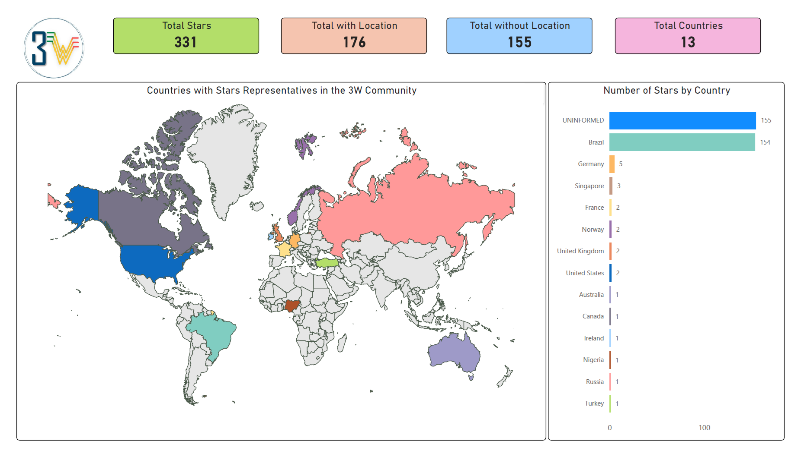
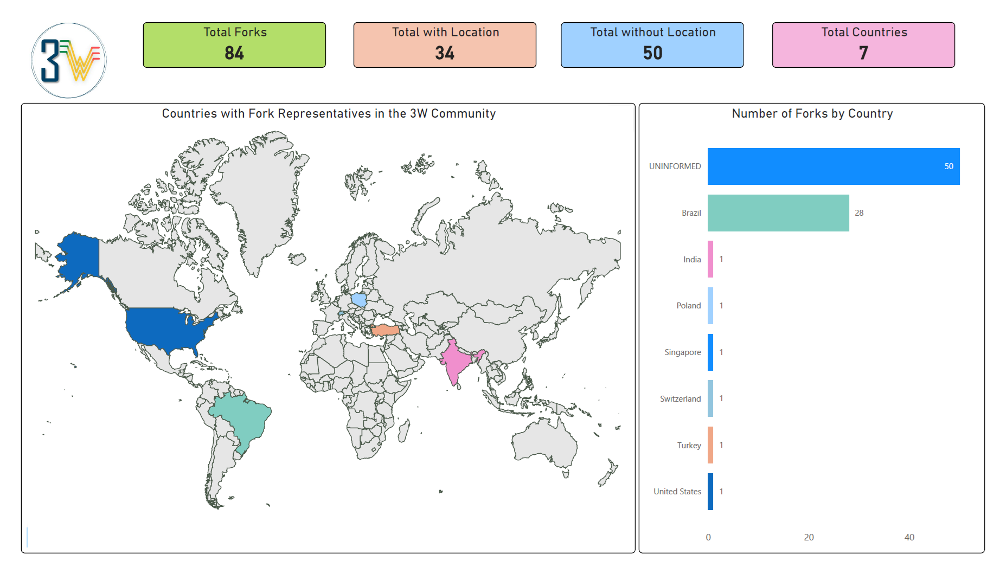

# Table of Content

* [Introduction](#introduction)
* [Citations](#citations)
  * [Main Institutions by Country](#main-institutions-by-country)
  * [All Institutions by Country](#all-institutions-by-country)
* [Stars by Country](#stars-by-country)
* [Forks by Country](#forks-by-country)

# Introduction

The 3W Community is gradually expanding and is made up of independent professionals and representatives of research institutions, startups, companies and oil operators from different countries.

The following sections provide more information about this community.

# Citations

The 3W Dataset was useful and is cited by the works listed [here](../LISTS_OF_CITATIONS.md). These are basically papers, final graduation projects, master's degree dissertations, and doctoral theses. In general, these works are carried out by representatives of institutions.

## Progress Over the Years

The chart below shows the cumulative number of works citing the 3W Dataset since 2019, highlighting the growing academic and institutional engagement over the years. This steady increase demonstrates the dataset's relevance across different types of research and institutions worldwide.

## Main Institutions by Country

The panel below shows for each country covered so far which institution gave rise to the largest number of citations (representatives x published works citing the 3W Dataset). In the event of a tie, all the tied institutions are presented for the same country.

## All Institutions by Country

The following panel shows the geographical dispersion of all identified institutions that have published works citing the 3W Dataset.

# Stars by Country

Below we have the locations of the GitHub users who gave stars to the 3W Project repository. It's important to note that not all GitHub users make their locations publicly available.

# Forks by Country

Now we have the locations of the GitHub users who generated forks of the 3W Project repository. Fork is a kind of copy that facilitates use, customization and contributions in Git repositories.

