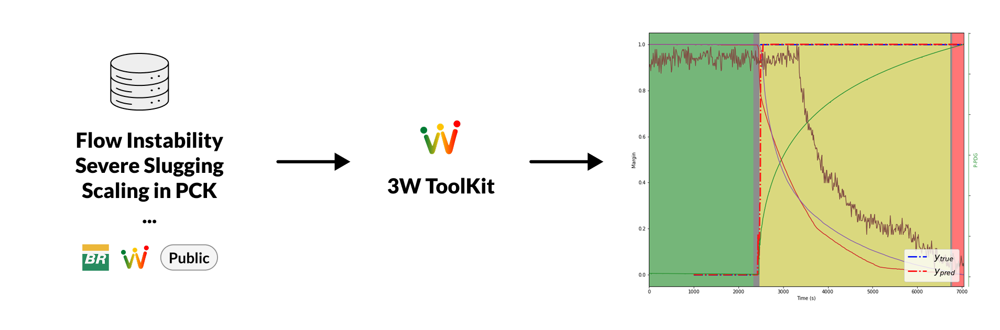
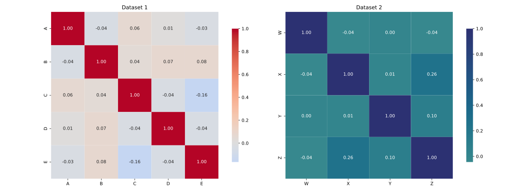
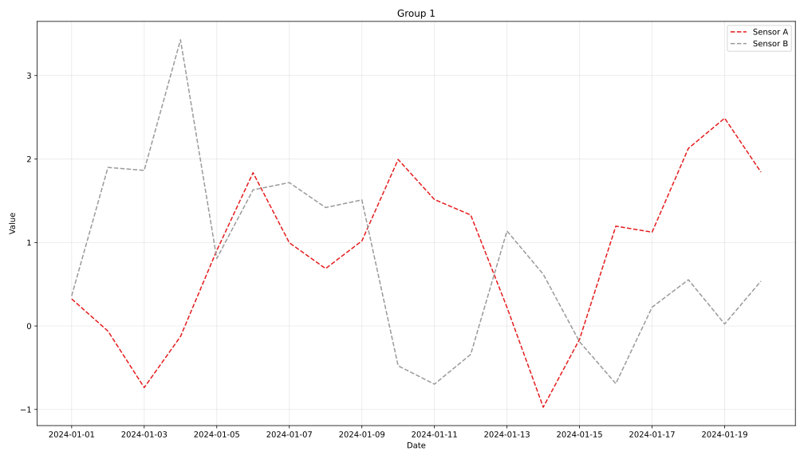

---
# "required metadata section by JOSS"
title: "3W Toolkit: A Set of Tools for Oil & Gas Data Processing and Analysis"
tags:
  - Python
  - Jupyter notebooks
  - Signal processing
  - Time series
authors:
  - name: Ricardo E. V. Vargas
    affiliation: 2
    orcid: 0000-0001-6243-4590
  - name: Afrânio J. M. Junior
    affiliation: 2
    orcid: 0000-0002-7279-3981
  - name: Rafael Padilla
    affiliation: 1
    orcid: 0000-0001-5961-1613
  - name: Thadeu L. B. Dias
    affiliation: 1
    orcid: 0000-0003-3371-5291
  - name: Matheus F. do E. Santo
    affiliation: 1
    orcid: 0009-0009-5672-815X
  - name: Eduardo H. Banaczewski
    affiliation: 1
    orcid: 0009-0007-1185-4115
  - name: Pedro H. B. Lisboa
    affiliation: 1
    orcid: 0000-0002-2931-4105
  - name: Gabriel H. B. Lisboa
    affiliation: 1
    orcid: 0009-0007-0525-8923
  - name: Luiza H. de A. Leite
    affiliation: 1
    orcid: 0009-0009-2426-7280
  - name: Matheus R. Parracho
    affiliation: 1
    orcid: 0009-0003-1578-889X
  - name: Bruno C. Martins
    affiliation: 1
    orcid: 0009-0006-8199-2006
affiliations:
  - index: 1
    name: Universidade Federal do Rio de Janeiro (UFRJ), Brazil
  - index: 2
    name: Petrobras, Brazil
bibliography: paper.bib
---

# Summary

The **3W Toolkit** is an open-source set of tools for time series processing,
providing early undesirable event detection, as well as correct diagnosis in oil well operations.

<!-- aimed at detecting and classifying events in oil well operations, -->

It features a modular architecture with stages for data preprocessing, feature extraction, dimensionality reduction, model training, performance evaluation, and graphical outputs. The toolkit is designed for data scientists and engineers in the oil and gas industry who need fast and efficient tools to explore large volumes of data in production and exploration environments. The current version of the software, **3W Toolkit v3.0.0**, is available as a Python package and includes extensive documentation and example workflows for integration with existing systems.

It targets the early automatic detection and classification of failure events during the practical operation of oil and gas wells and pipelines, as depicted in \autoref{fig:toolkit}. The events currently being considered are part of the publicly available **3W Dataset** [@VazVargas2026;@3Wdataset_github] developed by Petrobras [@petro], the Brazilian oil holding company. The **3W Dataset** serves as a reference dataset for this project and is hosted on Figshare[@figshare].



# Statement of need

Implementing corrective actions promptly helps avoid costly interventions in production wells. Timely fault identification is therefore essential. Petrobras’s publicly released **3W Dataset** [@3Wdataset_github] documents numerous fault types that may arise during actual oil-well operations. The pioneering work of the **3W Dataset**, developed by Petrobras, helped transform the oil and gas industry by providing the first public and realistic dataset containing real undesirable events in oil wells.

The **3W Toolkit** is part of the **3W** project developed by Petrobras [@petro] and the Signal, Multimedia and Telecommunications Laboratory (SMT)[@smt] and Signal Processing Laboratory (LPS)[@lps] from Federal University of Rio de Janeiro (UFRJ), aimed at providing tools for the processing and analysis of large volumes of data from oil and gas exploration and production operations. This set of tools includes functions for well data analysis and fault detection.

One motivation behind the design of the **3W Toolkit** is the need for integrated, accessible tools for professionals in the oil and gas industry who face challenges in handling large quantities of data. Undesirable event classification is performed using a modular framework with an efficient system design, allowing one to choose from several configurations of data pre-processing techniques, feature extraction, classifier algorithms, and desired performance metrics. The **3W Toolkit** provides a common ground of comparison. Without it, different researchers/companies would conduct different experiments with results that are difficult to compare. Another key point of the **3W Toolkit** is to make life easier for beginners in the 3W Community, who will have a ready-made package to explore the **3W Dataset**.

The toolkit is developed in Python and can be easily integrated with other Python-based systems and data analysis workflows. Additionally, the **3W Toolkit** is open-source, allowing the community to contribute and collaborate on its improvement.

# Architecture

A modular architecture is one of the cornerstones of the project, shaping both its design philosophy and its practical implementation. Therefore, software tools were designed so that each component or module operates independently, allowing it to be used, replaced, or updated without affecting the others. This type of architecture provides flexibility and scalability, enabling developers to customize and expand the toolkit according to their specific needs. With modules that can be reused across different projects, maintenance becomes easier, as issues can be fixed within individual modules without requiring changes to the entire system. In addition, customization is simplified by allowing different modules to be combined to create tailored solutions, while scalability is ensured by the ability to add new modules as demand grows, without major restructuring.

The **3W Toolkit** modularity facilitates constant system updates. Documentation allows for easier use by a wider community. A framework that is, to a certain extent, complete, incorporating various functionalities, encourages the use of this toolkit by a larger number of users. The schema shown in \autoref{fig:UML} illustrates the main classes of the toolkit.

To better describe the internal organization of the toolkit, the architecture can be divided into two main abstraction layers: the *Core* layer and the *Application* layer. The *Core* layer defines the fundamental abstractions that standardize how each component operates. It includes base classes such as `BaseDataset`, `BasePreprocessing`, `BaseFeatureExtractor`, `BaseModels`, `BaseTrainer`, and `BasePipeline`. These abstractions establish consistent interfaces across the system, ensuring that different implementations remain interchangeable. In addition, lightweight data containers such as `DatasetOutputs`, `TrainingResult`, `PredictionResult`, and `AssessmentOutput` are used to standardize communication between modules, reducing coupling and improving traceability of results.

The *Application* layer provides concrete implementations of these abstractions. For instance, `ParquetDataset` handles structured dataset loading, while `Normalize` and `Windowing` represent examples of preprocessing and feature extraction steps, respectively. Model implementations are divided into two main groups: deep learning models, represented by classes such as `TorchModels`, and traditional machine learning models, encapsulated by `SklearnModels`. This separation allows the toolkit to support heterogeneous modeling approaches within a unified interface.


Training is handled by specialized trainer classes such as `TorchTrainer` and `SklearnTrainer`, both derived from `BaseTrainer`. This design isolates training logic from model definitions, enabling reusage of training strategies across different models. Similarly, evaluation is performed through the `ModelAssessment` class, which produces standardized outputs independent of the underlying model type.

At a higher level, the `Pipeline` class orchestrates the entire workflow, integrating dataset loading, preprocessing, feature extraction, model training, prediction, and assessment. By encapsulating these steps into a single configurable component, it enables reproducible experiments, simplifying the execution of complex workflows such as cross-validation and performance evaluation.

Finally, the use of configuration-driven components (via dedicated configuration classes) and instantiation patterns ensures that experiments can be easily reproduced and modified. This design choice reinforces the toolkit’s flexibility, making it suitable for both research and production environments.

# Installation

The 3W Toolkit can be installed directly from PyPI using pip:

```bash
pip install ThreeWToolkit
```

This is the recommended option for users who only want to use the package.

Alternatively, users who want to inspect the source code, contribute to the project, or work from a cloned or forked repository can install the package locally. The source code is available at:

https://github.com/petrobras/3W.git

After cloning or forking the repository, we recommend creating an isolated Python environment before installing the package. For example, using uv:

```bash
uv venv                    # Create virtual environment
source .venv/bin/activate  # On Linux/macOS
.venv\Scripts\activate     # On Windows

cd toolkit/ThreeWToolkit
uv pip install -e .
```

The same local installation can also be performed with pip:

```bash
pip install -e .
```

# Features

The **3W Toolkit** provides a modular and extensible framework for time-series analysis, focusing on fault detection and classification in oil well operations. Its main capabilities include:

* **Dataset handling and filtering.**
The toolkit provides utilities for loading structured datasets (e.g., Parquet format) and supports flexible filtering by event type, target classes, and custom file lists. This enables reproducible dataset splits and controlled experimentation.

* **Preprocessing pipelines.**
A set of reusable preprocessing components is available, including signal cleaning, missing value imputation, normalization, label handling, and column transformations. These components can be composed into sequential pipelines, ensuring consistency between training and inference.

* **Feature extraction for time-series data.**
The toolkit includes multiple feature extraction strategies based on windowed signals. Available methods include statistical descriptors, exponentially weighted statistics, and wavelet-based features. These approaches can be combined to produce richer representations of temporal data.

* **Visualization and exploratory analysis.**
Built-in visualization utilities support inspection of individual signals, comparison across multiple series, and correlation analysis. These tools assist in understanding data characteristics before modeling.

* **Model training with heterogeneous backends.**
The framework supports both deep learning models (via PyTorch) and traditional machine learning models (via Scikit-learn), providing a unified interface for training, prediction, and model persistence.

* **Pipeline-based workflow orchestration.**
An integrated pipeline abstraction allows users to define end-to-end workflows, including dataset loading, preprocessing, feature extraction, training, and evaluation. This design improves reproducibility and reduces boilerplate code.

* **Evaluation and reporting.**
The toolkit provides standardized evaluation outputs and supports multiple performance metrics. Additionally, it includes automated report generation in HTML and LaTeX formats, facilitating result sharing and documentation.

* **Experiment reproducibility.**
Configuration-driven components and explicit control over dataset splitting, preprocessing, and model parameters ensure that experiments can be consistently reproduced and compared.


# Example Usage

The following example demonstrates a minimal workflow using the **3W Toolkit**, including dataset loading, preprocessing, feature extraction, model training, and evaluation.

```python
from ThreeWToolkit.dataset import (
    ParquetDatasetConfig,
    TransformConfig
)
from ThreeWToolkit.preprocessing import (
    CleanSignalsConfig,
    ImputeMissingConfig,
    NormalizeConfig,
    SequentialPreprocessingAdapterConfig
)
from ThreeWToolkit.feature_extraction import (
    WindowingConfig,
    StatisticalConfig,
    SequentialFeatureAdapterConfig,
)
from ThreeWToolkit.models import MLPConfig
from ThreeWToolkit.trainer import TorchTrainerConfig
from ThreeWToolkit.assessment import ModelAssessmentConfig


# Load dataset
dataset = ParquetDatasetConfig(path="./dataset").build()

# Define preprocessing + feature extraction pipeline
transform = TransformConfig(
    pre_processing=SequentialPreprocessingAdapterConfig(
        steps=[
            CleanSignalsConfig(),
            ImputeMissingConfig(),
            NormalizeConfig(),
        ]
    ),
    feature_extraction=SequentialFeatureAdapterConfig(
        steps=[
            WindowingConfig(window_size=128),
            StatisticalConfig(),
        ]
    ),
).build()

# Apply transformations
transform.fit(dataset)
dataset_transformed = transform.transform(dataset)

# Define model and trainer
trainer = TorchTrainerConfig(
    config_model=MLPConfig(hidden_sizes=(32, 16)),
    epochs=10,
).build()

# Train model
training_result = trainer.train(dataset_transformed)

# Predict and evaluate
predictions = trainer.predict(dataset_transformed)

assessment = ModelAssessmentConfig(metrics=["accuracy"]).build()
results = assessment.evaluate(
    training_results=training_result,
    predictions=predictions,
)

print(results.metrics)
```

# Data Visualization

The 3W Toolkit provides a data visualization module (`DataVisualization`) that supports the creation of graphical representations for temporal series analysis. This module enables users to explore, interpret, and communicate patterns in the data more clearly and effectively.

\autoref{fig:heat} shows a correlation heatmap, which is one of the visualizations generated by the **3W Toolkit**, while \autoref{fig:sensor} shows temporal signal plots. These visualizations facilitate the comparison of different sensor signals and support the analysis of relationships among measured variables.


{ width=85% }


{ width=75% }


# Conclusions

The **3W Toolkit** provides an open-source and modular framework for developing fault detection and classification systems in oil well operations. Its design enables flexible integration of preprocessing, feature extraction, modeling, and evaluation components, supporting both research and practical applications. By combining a unified pipeline abstraction with support for multiple modeling approaches, the toolkit facilitates reproducible experiments, simplifying the development of end-to-end machine learning workflows for time-series data. A collection of Jupyter notebooks provides a step-by-step guide to understanding and using the **3W Toolkit** powerful features. Although the toolkit was developed with the **3W Dataset** as a reference, it is not limited to that dataset and can be adapted to other datasets and application domains.

# AI usage disclosure
This project used GitHub Copilot and Claude for documentation purposes, and all contributions were carefully reviewed by multiple authors for consistency and accuracy.

# References

