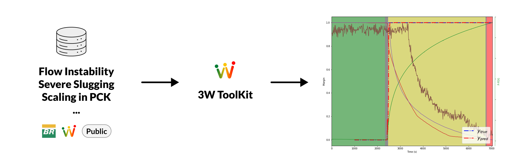
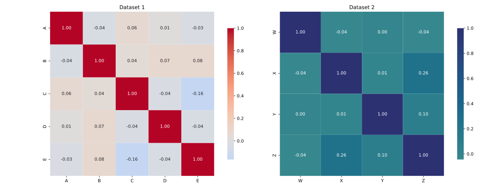
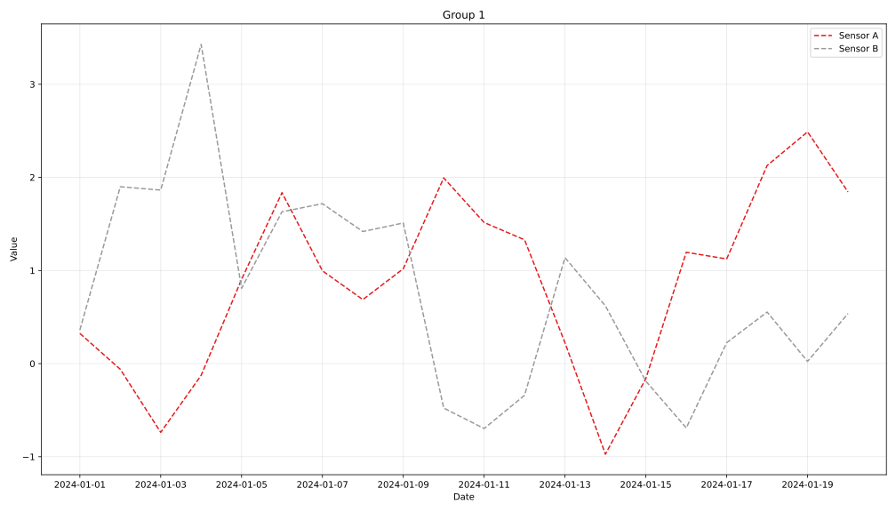

---
# "required metadata section by JOSS"
title: "3W Toolkit: A Set of Tools for Oil & Gas Data Processing and Analysis"
tags:
  - Python
  - Jupyter notebooks
  - Signal processing
  - Time series
authors:
  - name: Ricardo E. V. Vargas
    affiliation: 2
    orcid: 0000-0001-6243-4590
  - name: Afrânio J. M. Junior
    affiliation: 2
    orcid: 0000-0002-7279-3981
  - name: Rafael Padilla
    affiliation: 1
    orcid: 0000-0001-5961-1613
  - name: Thadeu L. B. Dias
    affiliation: 1
    orcid: 0000-0003-3371-5291
  - name: Matheus E. Santo
    affiliation: 1
    orcid: 0009-0009-5672-815X
  - name: Eduardo H. Banaczewski
    affiliation: 1
    orcid: 0009-0007-1185-4115
  - name: Pedro H. B. Lisboa
    affiliation: 1
    orcid: 0000-0002-2931-4105
  - name: Gabriel H. B. Lisboa
    affiliation: 1
    orcid: 0009-0007-0525-8923
  - name: Luiza H. de A. Leite
    affiliation: 1
    orcid: 0009-0009-2426-7280
  - name: Matheus R. Parracho
    affiliation: 1
    orcid: 0009-0003-1578-889X
  - name: Bruno C. Martins
    affiliation: 1
    orcid: 0009-0006-8199-2006
affiliations:
  - index: 1
    name: Universidade Federal do Rio de Janeiro (UFRJ), Brazil
  - index: 2
    name: Petrobras, Brazil
bibliography: paper.bib
---

# Summary

The **3W Toolkit** is an open-source tools for time series processing, providing early undesirable event detection and diagnosis in oil well operations.

<!-- aimed at detecting and classifying events in oil well operations, -->

It has a modular architecture covering data preprocessing, feature extraction, dimensionality reduction, model training, performance evaluation, and graphical outputs. It targets oil and gas professionals who need efficient tools to explore large production and exploration datasets. **3W Toolkit v3.0.0** is available as a Python package with documentation and example workflows for integration with existing systems.

It targets early automatic detection and classification of failure events in oil and gas wells and pipelines, as depicted in \autoref{fig:toolkit}. The considered events belong to the public **3W Dataset** [@VazVargas2026;@3Wdataset_github], developed by Petrobras [@petro], a Brazilian oil holding company. The **3W Dataset** is the project reference dataset and is hosted on Figshare[@figshare].



# Statement of need

Prompt corrective actions help avoid costly production-well interventions, making timely fault identification essential. Petrobras’s public **3W Dataset** [@3Wdataset_github] documents fault types from oil-well operations. This pioneering dataset helped transform the oil and gas industry by providing the first public, realistic dataset containing real undesirable oil-well events.

The **3W Toolkit** is part of the **3W** project developed by Petrobras [@petro], the Signal, Multimedia and Telecommunications Laboratory (SMT)[@smt], and Signal Processing Laboratory (LPS)[@lps] at the Federal University of Rio de Janeiro (UFRJ). It provides tools to process and analyze large volumes of oil and gas exploration and production data, including well analysis and fault detection.

The **3W Toolkit** addresses the need for integrated, accessible tools for professionals handling large data volumes. Its modular framework supports multiple data preprocessing techniques, feature extraction methods, classifiers, and performance metrics. It provides a common comparison ground, avoiding incompatible experiments across researchers and companies. It also gives beginners in the **3W Community** [@3Wcommunity] a ready-made package for exploring the **3W Dataset**.

Developed in Python, the toolkit integrates easily with Python-based systems and data analysis workflows. As open-source software, it also supports community collaboration and improvement.

The **3W Toolkit** has evolved across architecture, software design, data structures, and features. The current version currently processes `.parquet` files for better memory efficiency and faster queries, streamlines large-scale workflows, and includes machine learning features for time-series anomaly detection and event classification. It now uses a modular, object-oriented package with dedicated sub-modules. Unlike the initial standalone scripts and Jupyter Notebooks for parsing raw sensor streams, the current release is a standardized package managed through modern dependency structures (pyproject.toml) and installed via PyPI.

# State of the field
Petrobras launched the **3W Community** [@3Wcommunity], an international collaboration of researchers, startups, companies, and independent data scientists developing artificial intelligence and machine learning tools for early offshore oil-well event detection. With the widespread adoption of the **3W Dataset** [@3Wdataset_github] among research institutions, the **3W Toolkit** was designed to streamline these efforts.
While time-series toolkits (e.g., `sktime`, `tsfresh`) provide foundational algorithms, they lack domain-specific knowledge of oil-well variables, multi-source telemetry differences (simulated vs. real events), and 3W operational constraints. Rather than competing with general-purpose tools, the **3W Toolkit** connects raw sensor data to standard machine learning paradigms, keeping comparisons within the 3W Community reproducible and aligned with industry standards.

There are currently no other specialized Python packages, frameworks, or toolkits 
built specifically to address the heterogeneous composition and multi-source nature
of the **3W Dataset**. Without a unified framework like the **3W Toolkit**, researchers must create isolated ingestion scripts, causing inconsistent handling of real, simulated, 
and hand-drawn synthetic instances. The **3W Toolkit** therefore consolidates one-off scripts into a standardized, reproducible platform.


# Software design 

Modularity is a cornerstone of the project. Each component operates independently and can be used, replaced, or updated without affecting others. This architecture improves flexibility and scalability, enabling customization and expansion. Reusable modules simplify maintenance because issues can be fixed locally. Modules can also be combined into tailored solutions, while new ones can be added without major restructuring.

The **3W Toolkit** modularity supports updates, while documentation improves accessibility. Its broad functionality encourages adoption by more users. The schema in \autoref{fig:UML} shows the toolkit’s main classes.

The architecture has two abstraction layers: *Core* and *Application*. The *Core* layer defines fundamental abstractions and includes `BaseDataset`, `BasePreprocessing`, `BaseFeatureExtractor`, `BaseModels`, `BaseTrainer`, and `BasePipeline`. These provide consistent interfaces that keep implementations interchangeable. Lightweight containers such as `DatasetOutputs`, `TrainingResult`, `PredictionResult`, and `AssessmentOutput` standardize communication between modules, reduce coupling, and improve result traceability.

The *Application* layer implements these abstractions. `ParquetDataset` handles structured dataset loading, while `Normalize` and `Windowing` provide preprocessing and feature extraction. Models are divided into deep learning, represented by `TorchModels`, and traditional machine learning, encapsulated by `SklearnModels`. This separation supports heterogeneous modeling through one interface.


Training uses specialized classes such as `TorchTrainer` and `SklearnTrainer`, both derived from `BaseTrainer`. Separating training logic from models enables reuse across models. Evaluation uses `ModelAssessment`, which produces standardized outputs independent of model type.

`Pipeline` orchestrates dataset loading, preprocessing, feature extraction, training, prediction, and assessment. Encapsulating these steps in one configurable component enables reproducible experiments and simplifies workflows such as cross-validation and performance evaluation.

Finally, configuration-driven components and instantiation patterns make experiments easy to reproduce and modify. This design supports both research and production environments.

# Installation

The **3W Toolkit** is currently distributed as part of the 3W Project repository. The source code can be obtained from: https://github.com/petrobras/3W.git.

The toolkit is located in the `toolkit/ThreeWToolkit` directory. It is recommended to install it within an isolated Python environment.

For example, using `uv`:

```bash
uv venv                    # Create virtual environment
source .venv/bin/activate  # On Linux/macOS
.venv\Scripts\activate     # On Windows

cd toolkit/ThreeWToolkit
uv pip install -e .
```
Alternatively, installation can be performed using `pip`:

```bash
pip install -e .
```

This will install the toolkit in editable mode, allowing users to modify and extend its components.


# Features

The **3W Toolkit** provides a modular, extensible framework for time-series fault detection and classification in oil well operations. Its main capabilities include:

* **Dataset handling and filtering.**
Utilities load structured datasets (e.g., Parquet) and filter by event type, target classes, and custom file lists, enabling reproducible splits and controlled experiments.

* **Preprocessing pipelines.**
Reusable components provide signal cleaning, missing value imputation, normalization, label handling, and column transformations. They can be composed into sequential pipelines for consistent training and inference.

* **Feature extraction for time-series data.**
Window-based strategies include statistical descriptors, exponentially weighted statistics, and wavelet-based features, which can be combined into richer temporal representations.

* **Visualization and exploratory analysis.**
Built-in utilities inspect individual signals, compare series, and analyze correlations, helping users understand data before modeling.

* **Model training with heterogeneous backends.**
The framework supports deep learning via PyTorch and traditional machine learning via Scikit-learn through a unified interface for training, prediction, and model persistence.

* **Pipeline-based workflow orchestration.**
An integrated abstraction defines end-to-end workflows covering loading, preprocessing, feature extraction, training, and evaluation, improving reproducibility and reducing boilerplate.

* **Evaluation and reporting.**
The toolkit provides standardized evaluation outputs, multiple metrics, and automated HTML and LaTeX reports for sharing and documentation.

* **Experiment reproducibility.**
Configuration-driven components and explicit dataset splitting, preprocessing, and model parameters enable consistent reproduction and comparison of experiments.


# Example Usage

The following example shows a minimal **3W Toolkit** workflow for dataset loading, preprocessing, feature extraction, model training, and evaluation.

```python
from ThreeWToolkit.dataset import (
    ParquetDatasetConfig,
    TransformConfig,
)
from ThreeWToolkit.preprocessing import (
    CleanSignalsConfig,
    ImputeMissingConfig,
    NormalizeConfig,
    SequentialPreprocessingAdapterConfig,
)
from ThreeWToolkit.feature_extraction import (
    WindowingConfig,
    StatisticalConfig,
    SequentialFeatureAdapterConfig,
)
from ThreeWToolkit.models import MLPConfig
from ThreeWToolkit.trainer import TorchTrainerConfig
from ThreeWToolkit.assessment import ModelAssessmentConfig


# Load dataset
dataset = ParquetDatasetConfig(path="./dataset").build()

# Define preprocessing + feature extraction pipeline
transform = TransformConfig(
    pre_processing=SequentialPreprocessingAdapterConfig(
        steps=[
            CleanSignalsConfig(),
            ImputeMissingConfig(),
            NormalizeConfig(),
        ]
    ),
    feature_extraction=SequentialFeatureAdapterConfig(
        steps=[
            WindowingConfig(window_size=128),
            StatisticalConfig(),
        ]
    ),
).build()

# Apply transformations
transform.fit(dataset)
dataset_transformed = transform.transform(dataset)

# Define model and trainer
trainer = TorchTrainerConfig(
    config_model=MLPConfig(hidden_sizes=(32, 16)),
    epochs=10,
).build()

# Train model
training_result = trainer.train(dataset_transformed)

# Predict and evaluate
predictions = trainer.predict(dataset_transformed)

assessment = ModelAssessmentConfig(metrics=["accuracy"]).build()
results = assessment.evaluate(
    training_results=training_result,
    predictions=predictions,
)

print(results.metrics)
```

# Data Visualization

The 3W Toolkit provides a data visualization module (`DataVisualization`) for graphical temporal-series analysis, helping users explore, interpret, and communicate data patterns.

\autoref{fig:heat} shows a correlation heatmap generated by the **3W Toolkit**, while \autoref{fig:sensor} shows temporal signal plots. These visualizations support sensor comparison and analysis of relationships among measured variables.


{ width=85% }


{ width=75% }


# Research impact statement
The **3W Toolkit** bridges industry and academia through collaboration between Petrobras researchers and the Signal, Multimedia, and Telecommunications Laboratory (SMT) at the Federal University of Rio de Janeiro (UFRJ). Researchers recently used **3W Toolkit** (v3.0.0) to standardize the 3W Dataset pipeline with automated cleaning, temporal alignment, and class selection for robust loading [@pessoa2026multivariate; @deandrade2026operadores]. Standardized selection, filtering, and loading routines ensure reproducibility and compliance with dataset-maintainer quality criteria. The toolkit provides an industry-validated sandbox for testing academic contributions against real-world constraints, advancing well integrity and flow assurance automation.

# Conclusions

The **3W Toolkit** is an open-source, modular framework for fault detection and classification in oil well operations. It flexibly integrates preprocessing, feature extraction, modeling, and evaluation for research and practical applications. Its unified pipeline and multiple modeling approaches support reproducible end-to-end machine learning workflows for time-series data. Jupyter notebooks provide step-by-step guidance for its features. Although developed around the **3W Dataset**, the toolkit can be adapted to other datasets and application domains.

# AI usage disclosure
This project used GitHub Copilot and Claude for documentation purposes, and all contributions were carefully reviewed by multiple authors for consistency and accuracy.

# References
