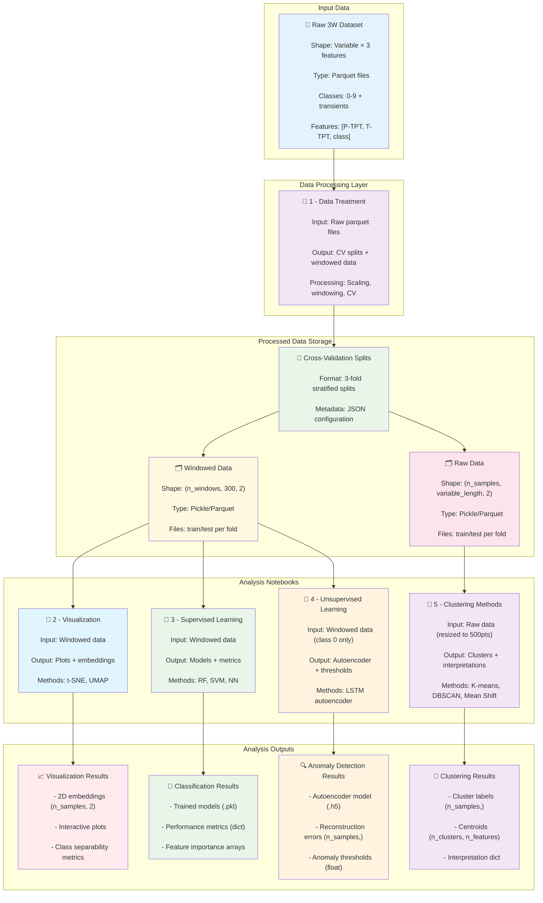
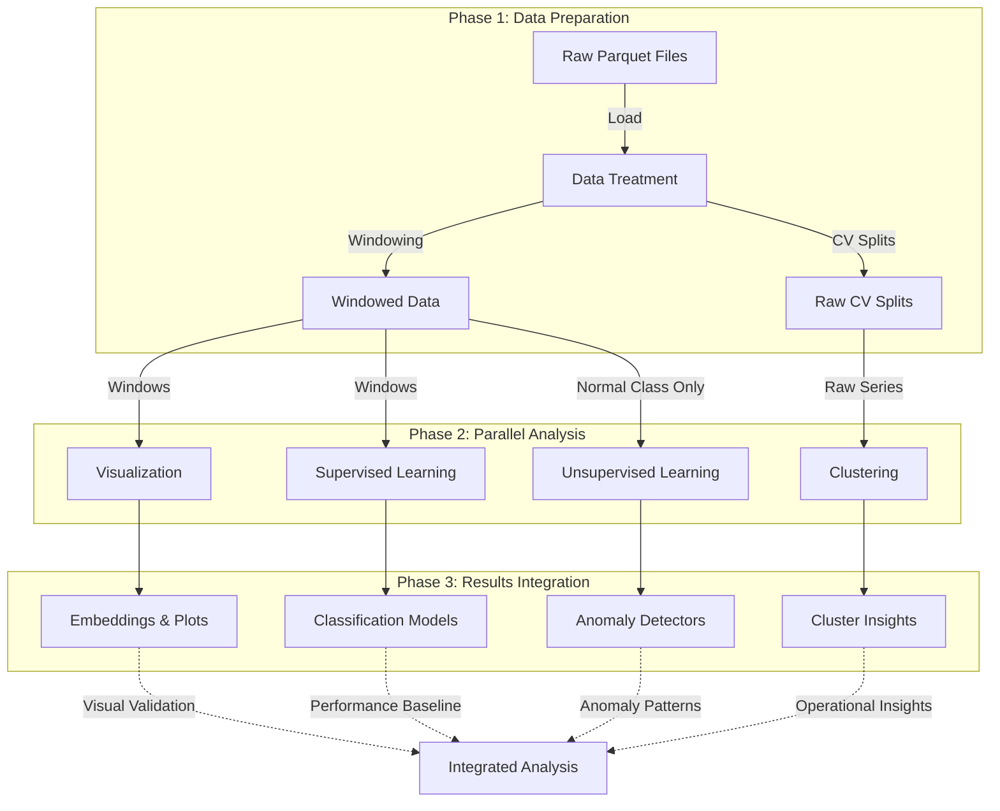

# 3W Dataset Machine Learning Pipeline

## 🎯 Overview

This repository contains a comprehensive machine learning pipeline for the **3W Dataset** - a real-world dataset for fault detection in oil wells. The pipeline includes data preprocessing, supervised learning, unsupervised learning, and clustering analysis methods.

## 📊 Pipeline Architecture & Data Contracts



## 📋 Data Contracts & Specifications

### Input Data Contract
```python
# Raw 3W Dataset Structure
{
    "files": "dataset/{class_id}/*.parquet",
    "schema": {
        "P-TPT": "float64",     # Pressure sensor readings
        "T-TPT": "float64",     # Temperature sensor readings  
        "class": "int64"        # Operational state (0-9, 101-109)
    },
    "shape": "(variable_length, 3)",
    "classes": {
        0: "Normal operation",
        1-9: "Various fault types", 
        101-109: "Transient states"
    },
    "constraints": {
        "min_length": 100,
        "max_length": 50000,
        "missing_values": "allowed"
    }
}
```

### Notebook 1 Output Contract
```python
# Data Treatment Outputs
{
    "windowed_data": {
        "path": "processed_data/cv_splits/windowed/fold_{i}/",
        "files": ["train_windowed.pickle", "test_windowed.pickle"],
        "structure": {
            "data": "List[DataFrame(300, 2)]",  # Fixed-length windows
            "labels": "List[int]",              # Class labels per window
            "shape": "(n_windows, 300, 2)"
        }
    },
    "raw_data": {
        "path": "processed_data/cv_splits/raw/fold_{i}/", 
        "files": ["train_data.pickle", "test_data.pickle"],
        "structure": {
            "data": "List[DataFrame(variable, 2)]",  # Original length series
            "labels": "List[int]",                   # Class labels per series
            "shape": "(n_samples, variable_length, 2)"
        }
    },
    "metadata": {
        "cv_splits": "3-fold stratified",
        "scaling_method": "minmax",
        "window_size": 300,
        "window_stride": 300
    }
}
```

### Notebook 2 Output Contract
```python
# Visualization Outputs
{
    "embeddings": {
        "tsne_2d": "numpy.ndarray(n_samples, 2)",
        "umap_2d": "numpy.ndarray(n_samples, 2)", 
        "labels": "numpy.ndarray(n_samples,)"
    },
    "plots": {
        "interactive_plots": "plotly.graph_objects.Figure",
        "static_plots": "matplotlib.figure.Figure"
    },
    "metrics": {
        "silhouette_score": "float",
        "separability_index": "float",
        "embedding_quality": "dict"
    }
}
```

### Notebook 3 Output Contract  
```python
# Supervised Learning Outputs
{
    "models": {
        "random_forest": "sklearn.ensemble.RandomForestClassifier",
        "svm": "sklearn.svm.SVC", 
        "neural_network": "sklearn.neural_network.MLPClassifier"
    },
    "predictions": {
        "y_pred": "numpy.ndarray(n_test_samples,)",
        "y_prob": "numpy.ndarray(n_test_samples, n_classes)",
        "y_true": "numpy.ndarray(n_test_samples,)"
    },
    "metrics": {
        "accuracy": "float",
        "f1_score_macro": "float", 
        "classification_report": "dict",
        "confusion_matrix": "numpy.ndarray(n_classes, n_classes)"
    },
    "feature_importance": {
        "rf_importance": "numpy.ndarray(n_features,)",
        "feature_names": "List[str]"
    }
}
```

### Notebook 4 Output Contract
```python
# Unsupervised Learning Outputs  
{
    "model": {
        "autoencoder": "tensorflow.keras.Model",
        "encoder": "tensorflow.keras.Model",
        "decoder": "tensorflow.keras.Model"
    },
    "anomaly_detection": {
        "reconstruction_errors": "numpy.ndarray(n_samples,)",
        "anomaly_scores": "numpy.ndarray(n_samples,)", 
        "threshold": "float",
        "predictions": "numpy.ndarray(n_samples,)"  # 0=normal, 1=anomaly
    },
    "metrics": {
        "detection_rate": "float",      # True positive rate
        "false_alarm_rate": "float",    # False positive rate
        "auc_score": "float",
        "optimal_threshold": "float"
    },
    "training_history": {
        "loss": "List[float]",
        "val_loss": "List[float]",
        "epochs": "int"
    }
}
```

### Notebook 5 Output Contract
```python
# Clustering Methods Outputs
{
    "clustering_data": {
        "X_original": "numpy.ndarray(n_samples, n_features)",  # Resized to 500pts
        "X_pca_2d": "numpy.ndarray(n_samples, 2)",            # PCA projection
        "y_labels": "numpy.ndarray(n_samples,)",              # True classes
        "file_info": "List[dict]"                             # Metadata per sample
    },
    "clustering_results": {
        "kmeans": {
            "labels": "numpy.ndarray(n_samples,)",
            "centroids": "numpy.ndarray(n_clusters, n_features)",
            "optimal_k": "int",
            "silhouette_score": "float"
        },
        "dbscan": {
            "labels": "numpy.ndarray(n_samples,)",      # -1 for noise
            "n_clusters": "int",
            "n_noise": "int",
            "silhouette_score": "float"
        },
        "meanshift": {
            "labels": "numpy.ndarray(n_samples,)",
            "cluster_centers": "numpy.ndarray(n_clusters, n_features)",
            "n_clusters": "int"
        }
    },
    "interpretation": {
        "cluster_class_mapping": "dict",               # Cluster to class correspondence
        "operational_insights": "dict",                # Oil well operation analysis
        "performance_comparison": "dict",              # Algorithm comparison
        "recommendations": "List[str]"                 # Practical recommendations
    }
}
```

## 📚 Notebook Pipeline Description

### 1️⃣ **Data Treatment** (`1 - Data Treatment.ipynb`)
**Purpose**: Foundation preprocessing and data preparation
- **Input**: Raw 3W dataset (`dataset/0-9/*.parquet`)
- **Processing**:
  - Centralized configuration management
  - Multiple scaling methods comparison
  - Smart cross-validation with real/simulated separation
  - Time windowing for sequence models
- **Output**: 
  - `processed_data/cv_splits/windowed/` - Windowed time series
  - `processed_data/cv_splits/raw/` - Raw time series with CV splits
  - Configuration metadata and preprocessing parameters

### 2️⃣ **Visualization Techniques** (`2 - Visualization Techniques copy.ipynb`)
**Purpose**: Exploratory data analysis and dimensionality reduction
- **Input**: Windowed data from `processed_data/cv_splits/windowed/`
- **Processing**:
  - Advanced dimensionality reduction (t-SNE, UMAP)
  - Class mapping and balanced sampling
  - Interactive dashboards and statistical insights
- **Output**: 
  - Interactive visualizations
  - Feature correlation analysis
  - Class separability insights

### 3️⃣ **Supervised Learning** (`3 - Introdution to Supervised Learning.ipynb`)
**Purpose**: Multi-class fault classification
- **Input**: Windowed data from `processed_data/cv_splits/windowed/`
- **Processing**:
  - Classification algorithms (Random Forest, SVM, Neural Networks)
  - Cross-validation evaluation
  - Performance metrics and comparison
- **Output**:
  - Trained classification models
  - Performance benchmarks
  - Feature importance analysis

### 4️⃣ **Unsupervised Learning** (`4 - Introdution to Unsupervised Learning.ipynb`)
**Purpose**: Novelty detection and anomaly identification
- **Input**: Windowed data from `processed_data/cv_splits/windowed/`
- **Processing**:
  - LSTM autoencoder training on normal data (class 0)
  - Reconstruction-based anomaly detection
  - Statistical threshold determination
- **Output**:
  - Novelty detection models
  - Anomaly scores and thresholds
  - Detection performance metrics

### 5️⃣ **Clustering Methods** (`5 - Clustering methods.ipynb`)
**Purpose**: Pattern discovery and operational insights
- **Input**: Raw data from `processed_data/cv_splits/raw/`
- **Processing**:
  - K-means clustering with elbow method
  - Density-based clustering (DBSCAN, Mean Shift)
  - Cluster interpretation and validation
- **Output**:
  - Cluster assignments and centroids
  - Operational pattern insights
  - Clustering quality metrics

## 🔄 Data Flow & Dependencies

### Pipeline Execution Graph


### Data Transformation Pipeline
```python
# Step-by-step data transformations

# 1. Raw Data → Data Treatment
raw_data = load_parquet_files()              # Shape: (variable, 3)
scaled_data = apply_scaling(raw_data)        # Shape: (variable, 3) 
windowed_data = create_windows(scaled_data)  # Shape: (n_windows, 300, 2)
cv_splits = stratified_split(windowed_data)  # 3 folds

# 2. Windowed Data → Analysis Notebooks
# Notebook 2: Visualization
flattened = flatten_windows(windowed_data)   # Shape: (n_windows, 600)
embeddings = reduce_dimensions(flattened)    # Shape: (n_windows, 2)

# Notebook 3: Supervised Learning  
X_train, y_train = prepare_classification()  # Shape: (n_train, 600), (n_train,)
models = train_classifiers(X_train, y_train) # sklearn estimators

# Notebook 4: Unsupervised Learning
normal_data = filter_class_0(windowed_data)  # Shape: (n_normal, 300, 2)
autoencoder = train_lstm_ae(normal_data)     # tensorflow.keras.Model

# 3. Raw Data → Clustering Analysis
resized_series = resize_to_500pts(raw_data)  # Shape: (n_samples, 1000)
clusters = apply_clustering(resized_series)  # Shape: (n_samples,)
```

### Memory & Performance Specifications
```python
# Resource requirements and performance characteristics

MEMORY_REQUIREMENTS = {
    "notebook_1": {
        "peak_memory": "2-4 GB",
        "processing_time": "5-15 minutes",
        "disk_space": "500 MB - 2 GB"
    },
    "notebook_2": {
        "peak_memory": "1-2 GB", 
        "processing_time": "2-5 minutes",
        "output_size": "10-50 MB"
    },
    "notebook_3": {
        "peak_memory": "2-3 GB",
        "processing_time": "10-30 minutes", 
        "model_size": "1-100 MB"
    },
    "notebook_4": {
        "peak_memory": "3-6 GB",
        "processing_time": "20-60 minutes",
        "model_size": "10-200 MB"
    },
    "notebook_5": {
        "peak_memory": "1-3 GB",
        "processing_time": "5-15 minutes",
        "output_size": "5-20 MB"
    }
}

DATA_VOLUME_SCALING = {
    "small_dataset": "< 1000 samples per class",
    "medium_dataset": "1000-10000 samples per class", 
    "large_dataset": "> 10000 samples per class",
    "memory_scaling": "O(n_samples × window_size × n_features)"
}
```

## 📋 Usage Instructions

### Prerequisites
```bash
# Install required packages
pip install -r requirements.txt
```

### Execution Order
1. **Start with Data Treatment**: Run `1 - Data Treatment.ipynb` first to prepare data
2. **Parallel Analysis**: Run notebooks 2-5 in any order (they're independent)
3. **Configuration**: Modify `src/config.py` for different parameters

### Quick Start
```python
# Verify data preparation
from src.data_persistence import DataPersistence
from src import config

persistence = DataPersistence(base_dir=config.PROCESSED_DATA_DIR)
print(f"Windowed data available: {persistence.check_windowed_data()}")
print(f"Raw data available: {persistence.check_raw_data()}")
```

## 🔧 Configuration

All pipeline parameters are centralized in `src/config.py`:

```python
# Key Configuration Parameters
TARGET_FEATURES = ['P-TPT', 'T-TPT', 'class']
WINDOW_SIZE = 300
N_FOLDS = 3
DEFAULT_SCALING_METHOD = 'minmax'
RANDOM_SEED = 42
```

## 📈 Expected Outputs

### Performance Metrics
- **Classification**: Accuracy, F1-score, ROC-AUC per class
- **Novelty Detection**: Detection rate, false alarm rate
- **Clustering**: Silhouette score, cluster purity, interpretability
- **Visualization**: Cluster separability, dimensionality reduction quality

### File Structure After Execution
```
processed_data/
├── cv_splits/
│   ├── windowed/
│   │   ├── fold_1/
│   │   │   ├── train_windowed.pickle
│   │   │   ├── test_windowed.pickle
│   │   │   └── windowing_metadata.json
│   │   ├── fold_2/
│   │   └── fold_3/
│   └── raw/
│       ├── fold_1/
│       │   ├── train_data.pickle
│       │   ├── test_data.pickle
│       │   └── fold_metadata.json
│       ├── fold_2/
│       └── fold_3/
└── metadata/
    ├── scaling_metadata.json
    └── cv_metadata.json
```

## 🎯 Learning Objectives

### Educational Goals
- **Data Pipeline Design**: Understanding end-to-end ML workflows
- **Algorithm Comparison**: Supervised vs unsupervised approaches
- **Real-world Applications**: Industrial fault detection challenges
- **Performance Evaluation**: Comprehensive metrics and validation
- **Pattern Discovery**: Clustering and visualization techniques

### Practical Skills
- **Time Series Processing**: Windowing and feature extraction
- **Cross-Validation**: Proper evaluation methodologies
- **Anomaly Detection**: Autoencoder-based novelty detection
- **Clustering Analysis**: Pattern discovery and interpretation
- **Visualization**: Dimensionality reduction and interactive plots

## 🚀 Advanced Usage

### Custom Configurations
- Modify window sizes and overlap in `src/config.py`
- Adjust cross-validation parameters for different splits
- Experiment with different scaling methods
- Customize clustering parameters and algorithms

### Extension Points
- Add new classification algorithms in notebook 3
- Implement additional clustering methods in notebook 5
- Extend visualization techniques in notebook 2
- Develop custom novelty detection approaches in notebook 4

## 📝 Notes

- **Data Dependencies**: Notebook 1 must be run before others
- **Memory Requirements**: Large datasets may require sampling
- **Execution Time**: Full pipeline can take several hours
- **Reproducibility**: Random seeds are set for consistent results

---

**Authors**: 3W Dataset Research Team  
**License**: [Specify License]  
**Last Updated**: September 2025
