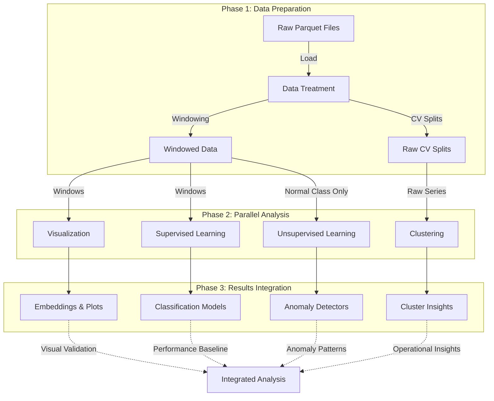

# Introduction to Machine Learning applied to Multivariate Time Series

## 🎯 Overview

This resource contains a comprehensive machine learning pipeline for the **3W Dataset** - a real-world dataset for fault detection in oil wells. The pipeline includes data preprocessing, supervised learning, unsupervised learning, and clustering analysis methods applied to **Multivariate Time Series (MTS)** data.

**🎓 Educational Use**: This resource is designed for educational purposes and can be utilized in **machine learning courses, workshops, tutorials, and academic programs** focusing on time series analysis, fault detection, and industrial applications.

**Multivariate Time Series (MTS)** refers to time-ordered data with multiple variables/sensors measured simultaneously over time. In the 3W dataset context, this includes multiple sensor readings (pressure, temperature, flow rates, etc.) from oil well operations captured at regular intervals.

## ⚠️ **Configuration Disclaimer**

> **📋 Important Note**: All configurations shown in this documentation (sensor variables, data shapes, window sizes, etc.) are **examples for demonstration purposes**. The pipeline is **fully configurable** and can be adapted to:
> - **Any sensor combination** (P-TPT, T-TPT are just examples)
> - **Variable window sizes** (300 points is configurable)
> - **Different feature counts** (shapes shown are examples)
> - **Custom preprocessing methods** (scaling, windowing, etc.)
> 
> **🔧 Customization**: Modify `src/config.py` to adapt the pipeline to your specific requirements. The current configuration is optimized for workshop presentation time constraints.

## 📊 Notebooks Architecture & Data Contracts

```mermaid
graph TB
    subgraph "Input Data"
        A["📁 Raw 3W Dataset<br/>
        Shape: Variable × 3 features<br/>
        Type: Parquet files<br/>
        Classes: 0-9 + transients<br/>
        Features: [P-TPT, T-TPT, class]"]
    end
    
    subgraph "Data Processing Layer"
        B["📓 1_data_treatment.ipynb<br/>
        Input: Raw parquet files<br/>
        Output: CV splits + windowed data<br/>
        Processing: Scaling, windowing, CV"]
    end
    
    subgraph "Processed Data Storage"
        C["💾 Cross-Validation Splits<br/>
        Format: 3-fold stratified splits<br/>
        Metadata: JSON configuration"]
        
        D["🗂️ Windowed Data<br/>
        Shape: (n_windows, 300, 2)<br/>
        Type: Pickle/Parquet<br/>
        Files: train/test per fold"]
        
        E["🗂️ Raw Data<br/>
        Shape: (n_samples, variable_length, 2)<br/>
        Type: Pickle/Parquet<br/>
        Files: train/test per fold"]
    end
    
    subgraph "Analysis Notebooks"
        F["📓 2_visualization_techniques.ipynb<br/>
        Input: Windowed data<br/>
        Output: Plots + embeddings<br/>
        Methods: t-SNE, UMAP"]

        G["📓 3_introduction_to_unsupervised_learning.ipynb<br/>
        Input: Windowed data (class 0 only)<br/>
        Output: Autoencoder + thresholds<br/>
        Methods: LSTM autoencoder"]
        
        H["📓 4_introduction_to_supervised_learning.ipynb<br/>
        Input: Windowed data<br/>
        Output: Models + metrics<br/>
        Methods: RF, SVM, NN"]
        
        I["📓 5_clustering_methods.ipynb<br/>
        Input: Raw data (resized to 500pts)<br/>
        Output: Clusters + interpretations<br/>
        Methods: K-means, DBSCAN, Mean Shift"]
    end
    
    subgraph "Analysis Outputs"
        J["📈 Visualization Results<br/>
        - 2D embeddings (n_samples, 2)<br/>
        - Interactive plots<br/>
        - Class separability metrics"]
        
        K["🤖 Classification Results<br/>
        - Trained models (.pkl)<br/>
        - Performance metrics (dict)<br/>
        - Feature importance arrays"]
        
        L["🔍 Anomaly Detection Results<br/>
        - Autoencoder model (.h5)<br/>
        - Reconstruction errors (n_samples,)<br/>
        - Anomaly thresholds (float)"]
        
        M["🧩 Clustering Results<br/>
        - Cluster labels (n_samples,)<br/>
        - Centroids (n_clusters, n_features)<br/>
        - Interpretation dict"]
    end
    
    A --> B
    B --> C
    C --> D
    C --> E
    
    D --> F
    D --> G
    D --> H
    E --> I
    
    F --> J
    G --> K
    H --> L
    I --> M
    
    style A fill:#e3f2fd
    style B fill:#f3e5f5
    style C fill:#e8f5e8
    style D fill:#fff8e1
    style E fill:#fce4ec
    style F fill:#e1f5fe
    style G fill:#e8f5e8
    style H fill:#fff3e0
    style I fill:#f3e5f5
    style J fill:#ffebee
    style K fill:#e8f5e8
    style L fill:#fff3e0
    style M fill:#f3e5f5
```



## 📋 Data Contracts & Specifications

### Input Data Contract
```python
# Raw 3W Dataset Structure
{
    "files": "dataset/{class_id}/*.parquet",
    "schema": {
        "P-TPT": "float64",     # Pressure sensor readings
        "T-TPT": "float64",     # Temperature sensor readings  
        "class": "int64"        # Operational state (0-9, 101-109)
    },
    "shape": "(variable_length, 3)",
    "classes": {
        0: "Normal operation",
        1-9: "Various fault types", 
        101-109: "Transient states"
    },
    "constraints": {
        "min_length": 100,
        "max_length": 50000,
        "missing_values": "allowed"
    }
}
```

### Notebook 1 Output Contract
```python
# Data Treatment Outputs
{
    "windowed_data": {
        "path": "processed_data/cv_splits/windowed/fold_{i}/",
        "files": ["train_windowed.pickle", "test_windowed.pickle"],
        "structure": {
            "data": "List[DataFrame(300, 2)]",  # Fixed-length windows
            "labels": "List[int]",              # Class labels per window
            "shape": "(n_windows, 300, 2)"
        }
    },
    "raw_data": {
        "path": "processed_data/cv_splits/raw/fold_{i}/", 
        "files": ["train_data.pickle", "test_data.pickle"],
        "structure": {
            "data": "List[DataFrame(variable, 2)]",  # Original length series
            "labels": "List[int]",                   # Class labels per series
            "shape": "(n_samples, variable_length, 2)"
        }
    },
    "metadata": {
        "cv_splits": "3-fold stratified",
        "scaling_method": "minmax",
        "window_size": 300,
        "window_stride": 300
    }
}
```

### Notebook 2 Output Contract
```python
# Visualization Outputs
{
    "embeddings": {
        "tsne_2d": "numpy.ndarray(n_samples, 2)",
        "umap_2d": "numpy.ndarray(n_samples, 2)", 
        "labels": "numpy.ndarray(n_samples,)"
    },
    "plots": {
        "interactive_plots": "plotly.graph_objects.Figure",
        "static_plots": "matplotlib.figure.Figure"
    },
    "metrics": {
        "silhouette_score": "float",
        "separability_index": "float",
        "embedding_quality": "dict"
    }
}
```

### Notebook 3 Output Contract  
```python
# Supervised Learning Outputs
{
    "models": {
        "random_forest": "sklearn.ensemble.RandomForestClassifier",
        "svm": "sklearn.svm.SVC", 
        "neural_network": "sklearn.neural_network.MLPClassifier"
    },
    "predictions": {
        "y_pred": "numpy.ndarray(n_test_samples,)",
        "y_prob": "numpy.ndarray(n_test_samples, n_classes)",
        "y_true": "numpy.ndarray(n_test_samples,)"
    },
    "metrics": {
        "accuracy": "float",
        "f1_score_macro": "float", 
        "classification_report": "dict",
        "confusion_matrix": "numpy.ndarray(n_classes, n_classes)"
    },
    "feature_importance": {
        "rf_importance": "numpy.ndarray(n_features,)",
        "feature_names": "List[str]"
    }
}
```

### Notebook 4 Output Contract
```python
# Unsupervised Learning Outputs  
{
    "model": {
        "autoencoder": "tensorflow.keras.Model",
        "encoder": "tensorflow.keras.Model",
        "decoder": "tensorflow.keras.Model"
    },
    "anomaly_detection": {
        "reconstruction_errors": "numpy.ndarray(n_samples,)",
        "anomaly_scores": "numpy.ndarray(n_samples,)", 
        "threshold": "float",
        "predictions": "numpy.ndarray(n_samples,)"  # 0=normal, 1=anomaly
    },
    "metrics": {
        "detection_rate": "float",      # True positive rate
        "false_alarm_rate": "float",    # False positive rate
        "auc_score": "float",
        "optimal_threshold": "float"
    },
    "training_history": {
        "loss": "List[float]",
        "val_loss": "List[float]",
        "epochs": "int"
    }
}
```

### Notebook 5 Output Contract
```python
# Clustering Methods Outputs
{
    "clustering_data": {
        "X_original": "numpy.ndarray(n_samples, n_features)",  # Resized to 500pts
        "X_pca_2d": "numpy.ndarray(n_samples, 2)",            # PCA projection
        "y_labels": "numpy.ndarray(n_samples,)",              # True classes
        "file_info": "List[dict]"                             # Metadata per sample
    },
    "clustering_results": {
        "kmeans": {
            "labels": "numpy.ndarray(n_samples,)",
            "centroids": "numpy.ndarray(n_clusters, n_features)",
            "optimal_k": "int",
            "silhouette_score": "float"
        },
        "dbscan": {
            "labels": "numpy.ndarray(n_samples,)",      # -1 for noise
            "n_clusters": "int",
            "n_noise": "int",
            "silhouette_score": "float"
        },
        "meanshift": {
            "labels": "numpy.ndarray(n_samples,)",
            "cluster_centers": "numpy.ndarray(n_clusters, n_features)",
            "n_clusters": "int"
        }
    },
    "interpretation": {
        "cluster_class_mapping": "dict",               # Cluster to class correspondence
        "operational_insights": "dict",                # Oil well operation analysis
        "performance_comparison": "dict",              # Algorithm comparison
        "recommendations": "List[str]"                 # Practical recommendations
    }
}
```

## 📚 Notebook Pipeline Description

### 1️⃣ **Data Treatment** (`1_data_treatment.ipynb`)
**Purpose**: Foundation preprocessing and data preparation for MTS analysis
- **Input**: Raw 3W dataset (`dataset/0-9/*.parquet`)
- **Processing**:
  - Centralized configuration management
  - Multiple scaling methods comparison for time series
  - Smart cross-validation with real/simulated separation
  - Time windowing for sequence models
- **Output**: 
  - `processed_data/cv_splits/windowed/` - Windowed multivariate time series
  - `processed_data/cv_splits/raw/` - Raw time series with CV splits
  - Configuration metadata and preprocessing parameters

### 2️⃣ **Visualization Techniques** (`2_visualization_techniques.ipynb`)
**Purpose**: Exploratory data analysis and dimensionality reduction for MTS
- **Input**: Windowed data from `processed_data/cv_splits/windowed/`
- **Processing**:
  - Advanced dimensionality reduction (t-SNE, UMAP) for time series
  - Class mapping and balanced sampling
  - Interactive dashboards and statistical insights
- **Output**: 
  - Interactive visualizations of multivariate patterns
  - Feature correlation analysis across time series
  - Class separability insights in reduced space

### 4️⃣ **Unsupervised Learning** (`3_introduction_to_unsupervised_learning.ipynb`)
**Purpose**: Novelty detection and anomaly identification in MTS
- **Input**: Windowed data from `processed_data/cv_splits/windowed/`
- **Processing**:
  - LSTM autoencoder training on normal multivariate sequences (class 0)
  - Reconstruction-based anomaly detection for time series
  - Statistical threshold determination for temporal patterns
- **Output**:
  - Novelty detection models for multivariate time series
  - Anomaly scores and thresholds for temporal deviations
  - Detection performance metrics for MTS anomalies

### 3️⃣ **Supervised Learning** (`4_introduction_to_supervised_learning.ipynb`)
**Purpose**: Multi-class fault classification in multivariate time series
- **Input**: Windowed data from `processed_data/cv_splits/windowed/`
- **Processing**:
  - Classification algorithms adapted for time series (Random Forest, SVM, Neural Networks)
  - Cross-validation evaluation with temporal considerations
  - Performance metrics and comparison for MTS classification
- **Output**:
  - Trained classification models for fault detection
  - Performance benchmarks for multivariate time series
  - Feature importance analysis across sensors and time
  
### 5️⃣ **Clustering Methods** (`5_clustering_methods.ipynb`)
**Purpose**: Pattern discovery and operational insights in multivariate time series
- **Input**: Raw data from `processed_data/cv_splits/raw/`
- **Processing**:
  - K-means clustering with elbow method for MTS patterns
  - Density-based clustering (DBSCAN, Mean Shift) for temporal clusters
  - Cluster interpretation and validation for operational states
- **Output**:
  - Cluster assignments and centroids for multivariate patterns
  - Operational pattern insights from time series clustering
  - Clustering quality metrics for MTS data

## 🔄 Data Flow & Dependencies

### Pipeline Execution Graph


### Data Transformation Pipeline
```python
# Step-by-step data transformations

# 1. Raw Data → Data Treatment
raw_data = load_parquet_files()              # Shape: (variable, 3)
scaled_data = apply_scaling(raw_data)        # Shape: (variable, 3) 
windowed_data = create_windows(scaled_data)  # Shape: (n_windows, 300, 2)
cv_splits = stratified_split(windowed_data)  # 3 folds

# 2. Windowed Data → Analysis Notebooks
# Notebook 2: Visualization
flattened = flatten_windows(windowed_data)   # Shape: (n_windows, 600)
embeddings = reduce_dimensions(flattened)    # Shape: (n_windows, 2)

# Notebook 3: Supervised Learning  
X_train, y_train = prepare_classification()  # Shape: (n_train, 600), (n_train,)
models = train_classifiers(X_train, y_train) # sklearn estimators

# Notebook 4: Unsupervised Learning
normal_data = filter_class_0(windowed_data)  # Shape: (n_normal, 300, 2)
autoencoder = train_lstm_ae(normal_data)     # tensorflow.keras.Model

# 3. Raw Data → Clustering Analysis
resized_series = resize_to_500pts(raw_data)  # Shape: (n_samples, 1000)
clusters = apply_clustering(resized_series)  # Shape: (n_samples,)
```

### Memory & Performance Specifications
```python
# Resource requirements and performance characteristics

MEMORY_REQUIREMENTS = {
    "notebook_1": {
        "peak_memory": "2-4 GB",
        "processing_time": "5-15 minutes",
        "disk_space": "500 MB - 2 GB"
    },
    "notebook_2": {
        "peak_memory": "1-2 GB", 
        "processing_time": "2-5 minutes",
        "output_size": "10-50 MB"
    },
    "notebook_3": {
        "peak_memory": "2-3 GB",
        "processing_time": "10-30 minutes", 
        "model_size": "1-100 MB"
    },
    "notebook_4": {
        "peak_memory": "3-6 GB",
        "processing_time": "20-60 minutes",
        "model_size": "10-200 MB"
    },
    "notebook_5": {
        "peak_memory": "1-3 GB",
        "processing_time": "5-15 minutes",
        "output_size": "5-20 MB"
    }
}

DATA_VOLUME_SCALING = {
    "small_dataset": "< 1000 samples per class",
    "medium_dataset": "1000-10000 samples per class", 
    "large_dataset": "> 10000 samples per class",
    "memory_scaling": "O(n_samples × window_size × n_features)"
}
```

## 📋 Usage Instructions

### Prerequisites

For all results generated by this ML pipeline to be **consistent**, we recommend using the conda virtual environment with package versions specified in the **local environment.yml** file within `resources\introduction_to_ml_applied_to_mts`. Our current recommendation is to use the conda distributed by **Miniforge**.

**🔧 Step-by-Step Setup Instructions:**

1. **Create and activate the conda environment:**

   ```bash
   # Create virtual environment from the local environment.yml
   conda env create -f environment.yml
   
   # Activate the created virtual environment  
   conda activate 3W-ml-mts
   
   # Start Jupyter Notebook for interactive analysis
   jupyter notebook
   ```

> **📋 Environment Notes**: 
> - **Local environment.yml** (`resources/introduction_to_ml_applied_to_mts/environment.yml`): Optimized specifically for ML pipeline with essential packages

### Execution Order
1. **Start with Data Treatment**: Run `1_data_treatment.ipynb` first to prepare MTS data
2. **Parallel Analysis**: Run notebooks 2-5 in any order (they're independent)
3. **Configuration**: Modify `src/config.py` for different MTS parameters

### Quick Start
```python
# Verify data preparation
from src.data_persistence import DataPersistence
from src import config

persistence = DataPersistence(base_dir=config.PROCESSED_DATA_DIR)
print(f"Windowed data available: {persistence.check_windowed_data()}")
print(f"Raw data available: {persistence.check_raw_data()}")
```

### 🔍 Troubleshooting Navigation

**Finding the correct directory path:**
```bash
# Windows - Find your 3W repository location
dir /s environment.yml

# Linux/macOS - Find your 3W repository location  
find ~ -name "environment.yml" -type f 2>/dev/null | grep 3W
```

**Verify you're in the correct directory:**
```bash
# You should see these files when you run:
ls          # Linux/macOS
dir         # Windows

# Expected output should include:
# - environment.yml
# - README.md  
# - src/
# - 1_data_treatment.ipynb
# - 2_visualization_techniques.ipynb
# - etc.
```

**Common path examples:**
```bash
# Windows examples:
cd "C:\Users\YourUsername\Documents\GitHub\3W\resources\introduction_to_ml_applied_to_mts"
cd "D:\Projects\3W\resources\introduction_to_ml_applied_to_mts"

# Linux/macOS examples:  
cd ~/Documents/3W/resources/introduction_to_ml_applied_to_mts
cd ~/Projects/3W/resources/introduction_to_ml_applied_to_mts
```

## 🔧 Configuration

All pipeline parameters are centralized in `src/config.py`:

```python
# Key Configuration Parameters
TARGET_FEATURES = ['P-TPT', 'T-TPT', 'class']
WINDOW_SIZE = 300
N_FOLDS = 3
DEFAULT_SCALING_METHOD = 'minmax'
RANDOM_SEED = 42
```

## 📈 Expected Outputs

### Performance Metrics
- **Classification**: Accuracy, F1-score, ROC-AUC per class
- **Novelty Detection**: Detection rate, false alarm rate
- **Clustering**: Silhouette score, cluster purity, interpretability
- **Visualization**: Cluster separability, dimensionality reduction quality

### File Structure After Execution
```
processed_data/
├── cv_splits/
│   ├── windowed/
│   │   ├── fold_1/
│   │   │   ├── train_windowed.pickle
│   │   │   ├── test_windowed.pickle
│   │   │   └── windowing_metadata.json
│   │   ├── fold_2/
│   │   └── fold_3/
│   └── raw/
│       ├── fold_1/
│       │   ├── train_data.pickle
│       │   ├── test_data.pickle
│       │   └── fold_metadata.json
│       ├── fold_2/
│       └── fold_3/
└── metadata/
    ├── scaling_metadata.json
    └── cv_metadata.json
```


## 🚀 Advanced Usage

### Custom Configurations
- Modify window sizes and overlap in `src/config.py` for different MTS analysis needs
- Adjust cross-validation parameters for different temporal splits
- Experiment with different scaling methods for multivariate data
- Customize clustering parameters and algorithms for time series patterns

### Extension Points
- Add new classification algorithms suitable for multivariate time series
- Implement additional clustering methods for temporal pattern discovery
- Extend visualization techniques for multivariate time series analysis
- Develop custom novelty detection approaches for specific MTS applications

## 📝 Notes

- **Data Dependencies**: Notebook 1 must be run before others to prepare MTS data
- **Memory Requirements**: Large multivariate time series datasets may require sampling
- **Execution Time**: Full pipeline can take several hours depending on MTS complexity
- **Reproducibility**: Random seeds are set for consistent results across temporal analyses
