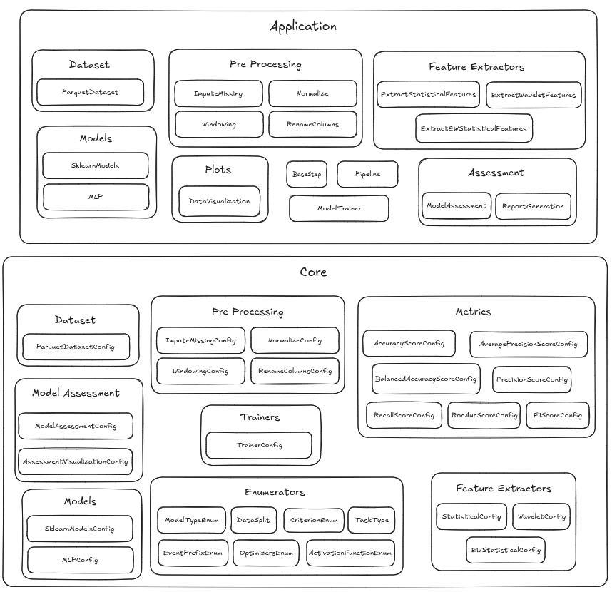

# Introduction to 3WToolkit v2.0.0

Welcome to the comprehensive tutorial series for the **3WToolkit v2.0.0**! This collection of Jupyter notebooks provides a step-by-step guide to understanding and using the toolkit's powerful features for time-series analysis, fault detection, and machine learning applications targeting not only the 3W Toolkit for oil well operations, but also for machine learning tasks in general.

## 📚 Tutorial Series Overview

This tutorial series consists of 8 progressive notebooks that will take you from basic concepts to advanced pipeline integration:

### 1. [Toolkit Overview](1_toolkit_overview.ipynb)
**Getting Started with 3WToolkit v2.0.0**
- Introduction to the toolkit's purpose and capabilities
- Understanding the modular architecture
- Key features and improvements in v2.0.0
- Use cases in oil & gas industry

### 2. [Installation Guide](2_installation.ipynb)
**Setting Up Your Development Environment**
- System requirements and dependencies
- Installation methods (pip, Poetry)
- Environment configuration
- Verification and testing setup

### 3. [Dataset Download](3_download_dataset.ipynb)
**Working with the 3W Dataset**
- Quick overview of the 3W dataset structure
- Downloading and accessing dataset files
- Data format and organization
- Initial data exploration

### 4. [Preprocessing](4_preprocessing.ipynb)
**Data Preparation and Cleaning**
- Missing data imputation strategies
- Data normalization techniques
- Windowing operations for time-series
- Column renaming and data validation

### 5. [Feature Extraction](5_feature_extraction.ipynb)
**Tools for Feature Engineering**
- Wavelet-based feature extraction
- Statistical feature extraction
- Exponential weighted statistical features

### 6. [Data Visualization](6_data_visualization.ipynb)
**Data Visualization**
- Correlation heatmap 
- Time-series visualization 
    - `plot_series`
    - `plot_mutiple_series`

### 7. [Model Training and Evaluation](7_model_training_and_evaluation.ipynb)
**Machine Learning Pipeline**
- Segmenting the signals into windows
- Training the model, using the windows as inputs
- Performance metrics and evaluation

### 8. [Pipeline Integration](8_pipeline_integration.ipynb)
**End-to-End Workflow**
- Creating a basic pipeline
- Pipeline modules overview
- Report generation

## 🏗️ Toolkit Architecture

The 3WToolkit v2.0.0 follows a modular architecture with clear separation between application-level components and core configuration systems:

### Application Layer
The application layer contains the main functional modules that users interact with:

- **Dataset**: `ParquetDataset` - Handles data loading and management
- **Preprocessing**: `ImputeMissing`, `Normalize`, `Windowing`, `RenameColumns` - Data preparation modules
- **Feature Extractors**: `ExtractStatisticalFeatures`, `ExtractWaveletFeatures`, `ExtractEWStatisticalFeatures` - Feature engineering
- **Models**: `SklearnModels`, `MLP` - Machine learning model implementations
- **Plots**: `DataVisualization` - Visualization and plotting capabilities
- **Assessment**: `ModelAssessment`, `ReportGeneration` - Model evaluation and reporting
- **Standalone Modules**: `BaseStep`, `Pipeline`, `ModelTrainer` - Core workflow components

### Core Layer
The core layer provides configuration and foundational components:

- **Configuration Modules**: Each application module has a corresponding `*Config` class for parameter management
- **Metrics**: Comprehensive evaluation metrics including `AccuracyScoreConfig`, `PrecisionScoreConfig`, `RecallScoreConfig`, `F1ScoreConfig`, `RocAucScoreConfig`, etc.
- **Enumerators**: Type-safe enumerations for `ModelTypeEnum`, `DataSplit`, `CriterionEnum`, `TaskType`, `EventPrefixEnum`, `OptimizersEnum`, `ActivationFunctionEnum`
- **Base Classes**: Abstract base classes that define interfaces and common functionality

## 🎯 Learning Objectives

By completing this tutorial series, you will:

1. **Understand** the 3WToolkit v2.0.0 architecture and design principles
2. **Master** data preprocessing techniques for time-series data
3. **Learn** advanced feature extraction methods for fault detection
4. **Implement** machine learning models for classification tasks
5. **Evaluate** model performance using domain-specific metrics
6. **Build** complete end-to-end pipelines for production use
7. **Apply** the toolkit to real-world oil well monitoring scenarios

## 🚀 Prerequisites

Before starting this tutorial series, ensure you have:

- Basic knowledge of Python programming
- Understanding of machine learning concepts
- Familiarity with time-series data analysis
- Basic knowledge of oil & gas operations (helpful but not required)

## 📖 How to Use This Series

1. **Sequential Learning**: Follow the notebooks in order, as each builds upon the previous concepts
2. **Hands-on Practice**: Execute all code cells and experiment with parameters
3. **Customization**: Modify examples to work with your own datasets
4. **Documentation**: Refer to the main toolkit documentation for detailed API references

## 🔗 Additional Resources

- [Main Toolkit Documentation](../../toolkit/ThreeWToolkit/README.md)
- [3W Dataset Documentation](../../dataset/README.md)
- [3W Dataset on Figshare](https://figshare.com/projects/3W_Dataset/251195)
- [API Reference](../../toolkit/ThreeWToolkit/)

## 🤝 Contributing

Found an issue or have suggestions for improvement? We welcome contributions! Please refer to the main project's contributing guidelines.

---

**Ready to get started?** Begin with [Notebook 1: Toolkit Overview](1_toolkit_overview.ipynb) to dive into the world of 3WToolkit v2.0.0!
