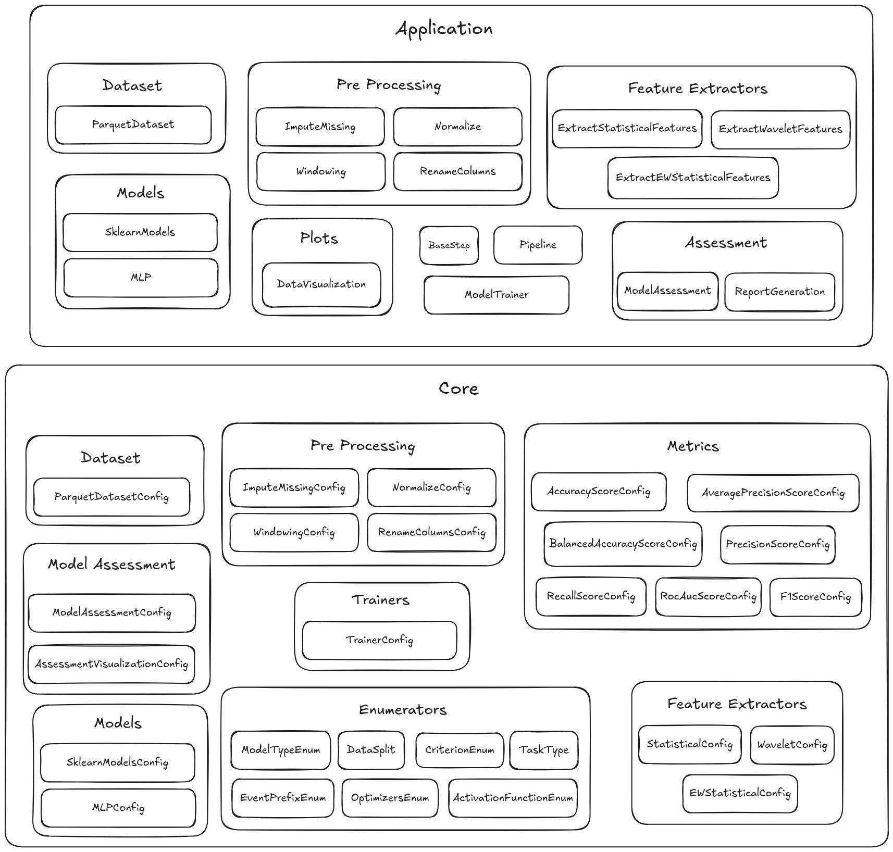

<h1>
  
  3W ToolKit
</h1>

<a id="readme-top"></a>

<summary>Table of Contents</summary>

<ol>
<li><a href="#about-the-project">About</a></li>
<li><a href="#architecture_overview">Architecture Overview</a></li>
<li><a href="#dataset">3W Dataset</a></li>
<li><a href="#installation">Installation & Setup</a></li>
<li><a href="#notebooks">Jupyter Notebooks & Examples</a></li>
<li><a href="#contributing">Contributing</a></li>
</ol>

## 📘 About <a id="about-the-project"></a>

The evolution of machine learning has been catalyzed by the rapid advancement in data acquisition systems, scalable storage, high-performance processing, and increasingly efficient model training through matrix-centric hardware (e.g., GPUs). These advances have enabled the deployment of highly parameterized AI models in real-world applications such as health care, finance, and industrial operations.

In the oil & gas sector, the widespread availability of low-cost sensors has driven a paradigm shift from reactive maintenance to condition-based monitoring (CBM), where faults are detected and classified during ongoing operation. This approach minimizes downtime and improves operational safety. The synergy between AI and big data analysis has thus enabled the development of generalizable classifiers that require minimal domain knowledge and can be effectively adapted to a wide range of operational scenarios.

In this context, we present 3WToolkit+, a modular and open-source AI toolkit for time-series processing, aimed at fault detection and classification in oil well operation. Building upon the experience with the original 3WToolkit system and leveraging the Petrobras <a href="https://github.com/petrobras/3W">3W Dataset</a>, 3WToolkit introduces enhanced functionalities, such as advanced data imputation, deep feature extraction, synthetic data augmentation, and high-performance computing capabilities for model training.

<p align="center">
  
  
</p>

The development of the 3WToolkit+ is the result of a collaborative partnership between Petrobras, with a focus on the CENPES research center, and the COPPE/Universidade Federal do Rio de Janeiro (UFRJ). This joint effort brings together complementary strengths: COPPE/UFRJ contributes decades of proven expertise in signal processing and machine learning model development, while CENPES offers access to highly specialized technical knowledge and real-world operational challenges in the oil and gas sector. This synergy ensures that 3WToolkit+ is both scientifically rigorous and practically relevant, addressing complex scenarios with robust and scalable AI-based solutions for time-series analysis and fault detection in oil well operations.

## 🧩 Architecture Overview <a id="architecture_overview"></a>

The following image illustrates the high-level architecture of the 3W Toolkit, designed to support the full pipeline of machine learning applications using the 3W dataset. From raw data ingestion to model evaluation and delivery to end users. 

The schema below illustrates the main classes of the toolkit. 



To better understand how the system is organized, we can divide all classes into two main abstraction layers: **`Application`** and **`Core`**.

* The **`Core`** layer contains all **configuration (`Config`) classes**. These classes define the parameters required by each functional module. In other words, they describe *how* each component should behave, specifying its inputs and parameters.

* The **`Application`** layer contains the **operational classes**, which implement the actual logic for interacting with datasets, preprocessing tools, feature extraction, models, evaluation, visualization, and pipelines. These are the classes that you will uses in workflows.


## 📊 3W Dataset <a id="dataset"></a>
The **3W dataset** serves as a **reference dataset** for this project and is hosted on [Figshare](https://figshare.com/projects/3W_Dataset/251195). However, the toolkit is not limited to the 3W dataset and can be adapted for other datasets as well. 

Further details on the 3W dataset’s structure, preprocessing, and usage are available in the [3W_DATASET_STRUCTURE.md](../3W_DATASET_STRUCTURE.md) file.


## ⚙️ Installation & Setup  <a id="installation"></a>

It is possible to perform the installation in different ways.

**1. Fork or clone the repository**  
**Option A: Fork** 
1. Go to [https://github.com/petrobras/3W](https://github.com/petrobras/3W)
2. Click “Fork” in the top-right corner to create a copy under your GitHub account.
3. Clone your forked repository:
```bash
git clone git@github.com:<your-username>/3W.git
```

**Option B: Clone**
```bash
git clone git@github.com:petrobras/3W.git
```

**2. Install the package**  
**Option A: Using `pip`** 
```bash
pip install -e .
```

**Option B: Using `uv`**
```bash
uv venv .venv
source venv/bin/activate
uv pip install -e .
```

**Option C: Using `conda`**
```bash
conda env create -f environment.yml
conda activate 3W
```

## 🪐 Jupyter Notebooks & Examples <a id="notebooks"></a>
A curated set of ready-to-use jupyter notebooks that demonstrate how to use the toolkit to common fault detection tasks using the 3W dataset. These examples accelerate onboarding and reproducibility.

The set of notebooks can be found in the [notebooks folder](../docs/notebooks/)


## 🤝 Contributing  <a id="contributing"></a>

We welcome contributions to help us improve and expand the functionality of the 3W toolkit. To ensure a smooth collaboration process, please follow our contrubuting guidelines [here](../CONTRIBUTING.md).


