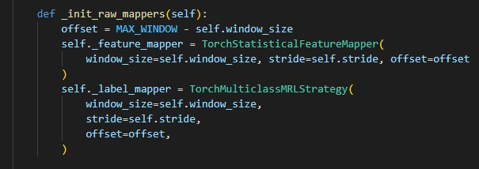
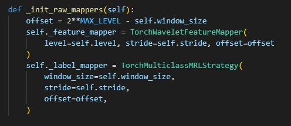

# Modular Artificial Intelligence System (MAIS)

This repository presents MAIS, a system that implements Machine Learning techniques in a modular way, enabling the developer to test their own experiments and/or adapt others' experiments with their own ideas. MAIS was developed by the Signal, Multimedia and Telecommunications (SMT) laboratory with the help of Petrobras.

**This version of MAIS has been adapted to be compatible with the 3W Dataset 2.0.**

In this version, MAIS implements a multiclass LGBM classifier, with the following optional features:

* Statistical features
    * Regular average within a window;
    * Exponentially weighted average within a window.
* Wavelets features
* Imputation methods: keep NaN values, change by the mean, ...
* Different labeling methods
    * Using the most recent label from a window as the label for that sample; or
    * Using the label in the middle of a window as the label for that sample.
* Feature selection using Random Forest importance

# Repository Structure

```
├── environment.yml
├── training
│   └── multiclass
│       ├── experiments
│       │   ├── base_experiment.py
│       │   ├── multi_ew_stats_mrl_nonan.py
│       │   └── ...
│       ├── train_lgbm.py
│       └── tune_lgbm.py
├── dataset
│   └── dataset.py
├── processing
│   ├── feature_mappers.py
│   └── label_mappers.py
├── utils
│   └── utils.py
├── visualization
│   └── generate_report.py
└── setup.py
```
MAIS uses a class called `Experiment`, which contains all the necessary steps to create your experiment.   
 To add your custom `Experiment` class, create a new file under the folder `experiments/multiclass/experiments/` based on the `BaseExperiment` defined in `experiments/multiclass/experiments/base_experiment.py`. Some examples are already implemented to give an idea of how an experiment is created.

The "mais/" folder contains class definitions that create everything used to create an experiment, i.e., it contains all utility classes. Some of them are:

1. `mais/dataset/dataset.py`: Defines the class `MAEDataset`, which contains the core logic behind the MAIS dataloader. Some of its functions are: read a `.csv`, read the feature extraction, create the final table (the model input).
2. `mais/processing/feature_mappers.py`:   
 Defines the classes that extract the attributes for a given experiment. The implementation uses PyTorch to make the extraction faster when using a lot of data. In the current version, there are some strategies already implemented, for example:
    1. `TorchStatisticalFeatureMapper`: Creates   
 statistical features from a rectangular window;
    2. `TorchWaveletFeatureMapper`: Creates wavelet features;
    3. `TorchEWStatisticalFeatureMapper`: Creates statistical features from a window with exponential weights for each sample.
3. `mais/processing/   
label_mappers.py`: Creates the classes that define how the detection is done. For example, it is possible to choose if the transient period of   
 the signal will be considered, or if the samples at the beginning of a file (which are usually not faulty) will be considered.

To add new utility functions and/or classes, the "mais/" folder is probably the best place (under the correspondent file). For example, if   
 you need to create a new feature extractor, the best way to proceed is by creating a new `FeatureMapper` under the file `mais/processing/feature_mappers.py`.

# Experiment examples

In the folder `experiments/multiclass/`, there are many examples that can guide you on how to create a new one:

1. `multi_ew_stats_mrl_nonan.py`
2. `multi_mixed_mrl_nonan.py`
3. `multi_mixed_select_mrl_nonan.py`
4. `multi_stats_mrl_nonan.py`
5. `multi_stats_select_mrl_nonan.py`
6. `multi_wavelets_mrl_nonan.py`
7. `multi_wavelets_select_mrl_nonan.py`

The names   
 of these experiments reflect what they implement. For example, the experiment `multi_stats_select_mrl_nonan.py` implements a multiclass classifier that uses statistical features, a feature selector, uses the most recent label as the label associated   
 with a window, and imputes NaN values. The acronyms used are:

* `multi`: Multiclass Experiment;
* `ew`: Exponentially weighted;
* `stats`: Statistical features;
* `mrl`: Most recent label;
* `nonan`: NaN imputation;
* `mixed`: Both statistical and wavelet features;
* `select`: Feature selector; and
* `wavelets`: Wavelets

For example, between experiments 4 and 6, the difference is the kind of features   
 that will be computed. In the first one, the exponentially weighted statistical features are used, and in the second one, just the wavelets. To do that, the difference is basically assigning the correspondent feature wrapper. The following image is the wrapper for Experiment 4 of the examples list.



And for experiment 6, we have:



# Using functions outside   
 the MAIS package

The functions defined within the MAIS package are being exposed to the `mais` package main folder. So, from the 3W folder, you can use the `RollingLabelStrategy` class, for example, by just doing

```python
from toolkit.mais import RollingLabelStrategy
```

In the future, it is possible to make it transparent to the user, abstracting the MAIS package path. For that, two steps are necessary:

1. Add the proper import into the __init__.py file in the 3W package; and   
2. Double-check if there are any functions with the same name.

# How to use
After creating the experiment and putting it into the experiment folder (for example, 'experiments/multiclass/experiments/example.py'),

1. [OPTIONAL] Initialize an ´mlflow´ server with an sqlite URI for the logs. In general, this option is the best one to avoid mlflow from creating tons of files.   
2. Execute ´tune_lgbm.py´. This script initializes an mlflow experiment containing all runs from the Bayesian optimization search. For every run, the script trains a model and saves its metrics. Its commands are:
   * data-root: Root directory with the data;
   * experiment-name: Name of the experiment (must be inside 'experiments/multiclass/experiments/');
   * num-trials: Number of Bayesian optimization trials;
   * inner-splits: Number of cross-validation inner loops;
   * outer-splits: Number of cross-validation outer loops;
   * n-jobs: Number of cores available for parallel processing; All these commands can also be consulted using --help. [P.S: Use appropriate environment variables for your mlflow log system.] 